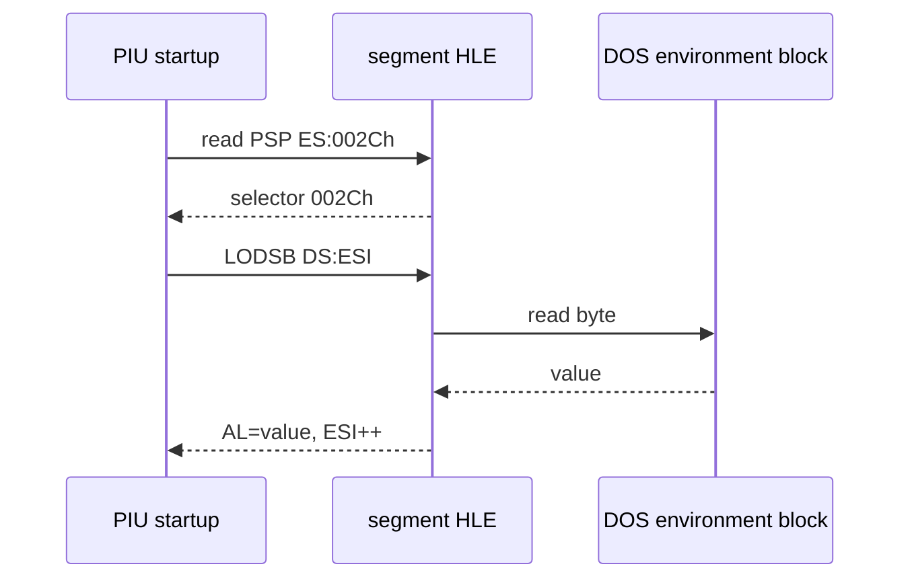

# DOS environment selector와 LODSB 작업 로그

## 분석 및 수정

DOS4GW 성공 분기 `+0xE4D1D~E4DA2`를 역추적했습니다. PSP `ES:[002Ch]` 값이 environment selector로 저장된 뒤 DS로 로드되며, `+0xE4DC4`의 `LODSB`는 환경 문자열의 NUL 종료를 탐색합니다. 임시 HLE의 0 반환을 `002Ch`로 교정하고 software DS 기반 `LODSB` 의미를 구현했습니다.

## 검증

* Win32 x86 Debug 전체 빌드 성공
* `LODSB` scan 중 2,367 dispatch 이상 진행 후 해당 경계 통과
* DOS resize `AH=4Ah`까지 진행
* 새 frontier: object 2 `+0xF8405`, `C7 04 02 FF FF FF FF`

새 명령은 SIB 주소형 allocator sentinel store이며 segment/environment 문제와 분리된 다음 작업입니다.

# DOS Environment Selector and LODSB Work Log

Recovered the successful DOS4GW startup path: PSP `ES:[002Ch]` supplies environment selector `002Ch`, and `LODSB` scans NUL-terminated environment entries. Restoring that selector and software-DS `LODSB` semantics passed the former frontier. The Win32 x86 build passed and execution reached object 2 `+0xF8405`, a separate SIB-addressed allocator sentinel store.
