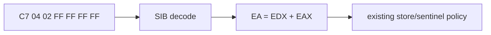

# SIB memory 주소 해석 작업 로그

## 결과

공용 ModR/M decoder에 32비트 SIB, no-index/no-base, absolute disp32, disp8/disp32 처리를 추가했습니다. `C7 04 02 FF FF FF FF`는 `EDX+EAX` 목적지와 즉시값 `FFFFFFFFh`로 해석되어 기존 allocator store 정책을 통과했습니다.

검증:

* Win32 x86 Debug 빌드 성공
* object 2 `+0xF8405` 통과
* 약 29,083 dispatch, memory store 3,604회 관찰
* `intro.ani` open/read 진행
* 새 frontier: object 2 `+0xF7AD4`, `83 0E 01`

# SIB Memory Address Decoding Work Log

Extended the shared decoder with 32-bit SIB, no-index/no-base, absolute disp32, and mod displacements. The former `EDX+EAX` sentinel store passed. The Win32 x86 build succeeded; runtime reached about 29,083 dispatches, 3,604 applied stores, and `intro.ani` I/O before stopping at the independent group-1 immediate OR at object 2 `+0xF7AD4`.
