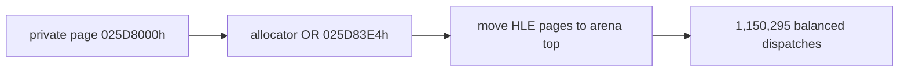

# LINEXE arena/allocator 충돌 교정 작업 로그

## 증거

초기 HLE 전용 범위는 `0x025D7000~0x025DA000`이었고 allocator metadata OR 목적지는 `0x025D83E4`였습니다. private-data 페이지와 allocator가 직접 겹쳤습니다. 실제 OR 적용 시 두 번 모두 약 32,013 dispatch에서 중첩 예외와 host AV가 재현됐습니다.

## 수정

HLE 세 페이지를 arena 상단 `0x035D4000~0x035D7000`으로 이동하고 동적 allocator 범위를 그 직전까지로 분리했습니다. arena 내부 `83 /1`은 실제 dword를 갱신하며 arena 밖 metadata에만 shadow 경로를 유지합니다.

## 검증

* Win32 x86 Debug 빌드 성공
* 10초 실행: 969,064 entry/exit 일치, host crash 없음
* 30초 제한 실행: 1,150,295 entry/exit 일치
* 파일 open 4회/read 11회
* 약 11.5초 후 원본 DLL-loader fatal 경로 도달

마지막 fatal은 arena 충돌과 분리된 LINEXE structure/gate 활성화의 다음 분석 대상입니다.

# LINEXE Arena/Allocator Collision Work Log

Confirmed direct overlap between the initial private page and allocator target `0x025D83E4`. Moving all three HLE pages to the arena top eliminated deterministic nested exceptions. Runs remained balanced through 969,064 and 1,150,295 dispatches. The later original DLL-loader fatal is now a separate LINEXE structure/gate issue.
