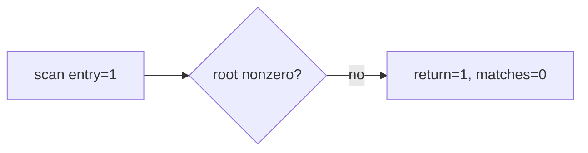

# LINEXE 해석 관찰 작업 로그

실행 결과에 saved GS, 8개 export slot, selector words와 scan 단계 계수를 추가했습니다. 관찰 결과 environment는 active, saved GS는 `0020h`, scan entry/return은 `1/1`이지만 module candidate와 export match는 모두 0입니다. 실패 범위는 `GS:0042h` root read로 좁혀졌습니다.

# LINEXE Resolution Observation Work Log

Added saved-GS, export-slot, selector-word, and scan-stage observations. Saved GS is `0020h`, but no module candidate is reached, isolating failure to the `GS:0042h` root read.
