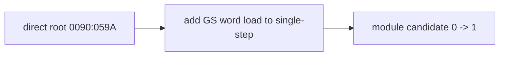

# LINEXE root memory 관찰 작업 로그

selector `0020h` descriptor는 base `0x035D4000`, limit `0x0FFF`로 유효하며 direct root는 정확히 `0090:059A`였습니다. 따라서 backing page는 정상이고 GS word-load가 single-step 목록에서 누락된 것이 원인이었습니다.

수정 후 module candidate는 1회 도달했지만 module-name match는 0입니다. 다음 범위는 selector `0090h` module record/name과 GS byte dispatch입니다.

# LINEXE Root-Memory Observation Work Log

Confirmed selector `0020h` at base `0x035D4000` with direct root `0090:059A`. Adding GS word-load to single-step dispatch changed module candidates from zero to one. The next failure is module-name comparison through selector `0090h`.
