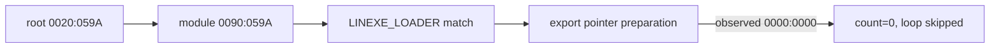

# 공용 segment memory-load 구현 결과

## 결과

`8A/8B`의 명시적 segment override memory load를 공용 ModR/M/SIB 경로에서 byte, word, dword 폭으로 처리하도록 구현했습니다. single-step HLE가 EIP를 다음 명령으로 옮긴 경우 연속된 segment load도 함께 처리합니다.

실행 관찰에서 `GS:0042/0044` root pointer, `0090:0504`의 `LINEXE_LOADER` 이름 14바이트, module match를 통과했습니다. 합성 module의 export count/table은 `8`, `0090:0522`로 정상입니다.

그러나 export loop는 아직 진입하지 않았습니다. module 후보 시점의 stack pointer는 `0090:059A`이지만 export count 비교 직전에는 `0000:0000`이며, `EAX=0`, `ECX=0`으로 비교됩니다. 다음 작업은 module match 뒤 stack-local far pointer 보존 경로의 누락된 명령 의미를 복원하는 것입니다.

## 검증

`scripts\\build_win32_x86.bat` 빌드에 성공했습니다. supervisor 실행으로 원본 fatal message까지 진행하면서 위 계측값을 반복 확인했습니다.

# Shared Segment Memory-Load Implementation Result

The shared ModR/M/SIB path now handles explicitly segment-overridden `8A/8B` byte, word, and dword loads, including consecutive sensitive loads after an HLE single-step advances EIP.

Runtime observation passes the `GS:0042/0044` root pointer, all 14 bytes of `LINEXE_LOADER` at `0090:0504`, and the module match. The synthetic export metadata is valid (`count=8`, table `0090:0522`). The remaining boundary is stack-local far-pointer preservation after the module match: it changes from `0090:059A` to `0000:0000`, so the export loop sees a zero count. The Win32 x86 build passed.
