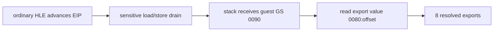

# LINEXE stack-local far pointer 보존 결과

## 확인 및 수정

module pointer는 near jump 전후 모두 `0090:059A`로 정상이며 스택에서 사라지지 않았다. 실패 원인은 HLE가 일반 명령을 처리하고 EIP를 다음 segment-sensitive 명령으로 옮긴 뒤 그 명령을 native CPU에 넘긴 것이었다. Windows host segment가 guest selector를 대신 사용하면서 low-memory의 0을 읽었다.

single-step HLE 성공 경계에서 후속 segment load/store를 drain하도록 중앙화했다. 또한 `8C /r` memory form을 공용 ModR/M/SIB decoder와 guest selector로 처리했다. 이로써 `mov [esp+18h],gs`가 host GS `002Bh`가 아니라 guest GS `0090h`를 저장한다.

## 검증

Win32 x86 빌드에 성공했다. supervisor 관찰에서 export loop 8회, 이름 match 8회, resolved export count 8을 확인했다. 마지막 entry도 `selector=0090`, `offset=055E`, `value=00800138`로 읽혀 결과 슬롯에 저장됐다.

기존 fatal message는 계속 출력되지만 실패 경계는 export 검색을 넘어 resolve된 `0080:xxxx` call gate 호출 단계로 이동했다.

# LINEXE Stack-Local Far-Pointer Preservation Result

The module pointer remains `0090:059A` across the near jump. The real fault was an HLE handler advancing EIP to a segment-sensitive instruction and allowing native execution with the host segment. The single-step success path now drains following segment loads/stores, and general `8C /r` memory forms store the software guest selector through shared ModR/M/SIB decoding.

The Win32 x86 build passes. Runtime observation reaches eight export-loop iterations, eight name matches, and eight resolved exports. The remaining fatal path is now after resolution, at invocation of the resolved `0080:xxxx` call gates.
