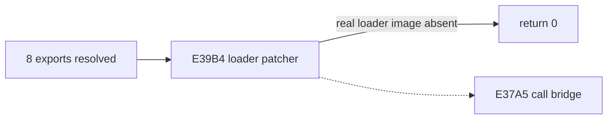

# LINEXE 선제 call-gate 관찰 결과

## 결과

공용 bridge의 far transfer `object2+E37A5`를 선제 전환 지점으로 정의하고 target/frame 관찰을 추가했다. 그러나 실행에서는 bridge entry가 0회였다. export resolve 함수는 caller에 `EAX=8`을 정상 반환하며 첫 검사를 통과한다.

다음 함수 `object2+E39B4`가 0을 반환해 기존 fatal 경로로 간다. 이 함수는 합성 export를 호출하지 않고 selector limit을 검사한 뒤 LINEXE loader segment 전체에서 `DLL modules not supported`, `dll\\msc`, `.dll`, `DOS/4G` 문자열과 opcode 패턴을 검색하고 loader bytes/path를 패치한다.

현재 합성 환경은 private record와 gate page만 제공하므로 실제 loader binary signature가 없다. 다음 결정은 실제로 실행하지 않을 loader image를 합성해 원본 patcher를 통과시킬지, HLE가 patcher의 목적을 대체했음을 명시적으로 반환할지이다. 선제 gate dispatch는 이 판정을 통과한 뒤 구현할 수 있다.

## 검증

Win32 x86 빌드에 성공했다. supervisor에서 resolved export count 8, scan caller EAX 8, bridge entry 0을 확인했다.

# LINEXE Preemptive Call-Gate Observation Result

The preemptive boundary is the shared bridge far transfer at `object2+E37A5`, but runtime observation records zero bridge entries. Export resolution correctly returns `EAX=8`; the subsequent function at `object2+E39B4` returns zero first. It scans and patches a real LINEXE loader segment using loader strings and opcode patterns, which the synthetic private environment intentionally does not contain.

The next decision is whether to synthesize an otherwise unused loader image for the original patcher or explicitly satisfy the patcher's purpose in HLE. The Win32 x86 build passes.
