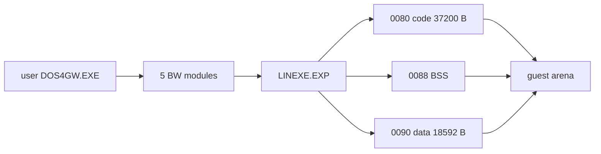

# DOS4GW asset 기반 LINEXE 런타임 추출 결과

플랫폼 독립 DOS/16M BW parser를 추가해 사용자 asset의 `DOS4GW.EXE`에서 `LINEXE.EXP`를 추출했다. selector별 image, limit, access, memory paragraph와 RSI-2 relocation offset을 보존한다.

arena를 추출 크기에 맞춰 예약하고 `0020/0080/0088/0090` descriptor를 등록했다. 원본 patcher 진행을 위해 software `LSL/LAR`, guest `REP CMPSB`, segment compare, word low-memory store, DPMI `0000h/0008h/0009h`도 구현했다.

추출값은 기존 증거와 일치했다: module 5개, header `155F4h`, next `20754h`, entry `0080:0013`, segment 3개, relocation 236개. Win32 x86 빌드에 성공했다. DLL-loader fatal은 사라졌고 DPMI selector `00A4/00AC/00B4`가 할당됐다. 현재 frontier는 DOS `INT 21h AH=43h`이며 bridge는 아직 호출되지 않았다.

# Runtime LINEXE Extraction Result

Added a platform-neutral DOS/16M BW parser and extracted `LINEXE.EXP` from the user-provided `DOS4GW.EXE`, preserving segment metadata and RSI-2 relocation locations. Size-aware arena placement registers selectors `0020/0080/0088/0090`; shared descriptor, string, low-memory, and DPMI semantics let the original loader patcher succeed.

Runtime values match prior evidence: five modules, header `155F4h`, next `20754h`, entry `0080:0013`, three segments, and 236 relocations. Win32 x86 builds successfully. The DLL-loader fatal disappears and execution now reaches DOS `INT 21h AH=43h` before any shared bridge call.
