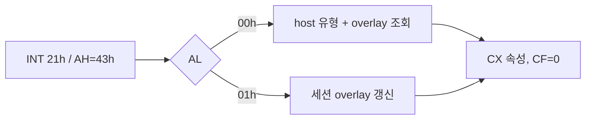

# DOS 파일 속성 HLE 작업 로그

`INT 21h AH=43h`의 조회(`AL=00h`)와 설정(`AL=01h`)을 DOS 가상 파일 시스템에 추가했습니다. 조회는 host 파일의 존재 여부와 파일/디렉터리 유형을 DOS 속성으로 변환하고, 설정은 원본 asset을 변경하지 않는 세션 한정 overlay에 저장합니다.

Win32 x86 빌드가 성공했습니다. 실행 관찰에서 이전 경계였던 `object 2 +0xF65FD`를 통과했으며, 다음 경계는 `object 2 +0xE34A0`의 `66 EA` 원거리 전이입니다. 해당 시점의 `EDI=0080:1B28`은 추출된 `LINEXE_LOADMODULE` export를 가리킵니다.

# DOS File-Attribute HLE Work Log

Implemented DOS file-attribute query (`AL=00h`) and set (`AL=01h`) for `INT 21h AH=43h`. Queries combine host file type with a virtual override, while sets update a session-only overlay without modifying user assets.

The Win32 x86 build passed. Runtime observation crossed the former `object 2 +0xF65FD` frontier and stopped at the `66 EA` far-transfer boundary at `object 2 +0xE34A0`. At that point, `EDI=0080:1B28` identifies the extracted `LINEXE_LOADMODULE` export.
