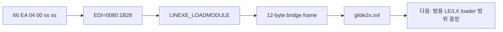

# LINEXE 원거리 전이 게이트 관찰 작업 로그

특정 PIU wrapper 주소에 의존하지 않고 LINEXE 전이를 식별하도록 원본 export decoder와 관찰기를 추가했습니다. 관찰 조건은 활성 LINEXE 환경, `66 EA 04 00` 명령 prefix, `EDI`의 복원된 원본 export selector:offset 일치입니다. relocation으로 즉시 selector가 `002Ch`가 되는 것이 확인되어 selector 값은 opcode 조건에 고정하지 않았습니다.

동적 관찰에서 `ESP=025D6A84`, `EBP=025D6A88`, 반환 주소 `020F37B2`를 확인했습니다. 현재 ESP의 `+24h`에 있는 정규화된 문자열 포인터는 `glide2x.ovl`을 가리키며 해당 asset이 실제로 존재합니다. 따라서 합성 성공값만 반환하는 구현은 충분하지 않고, 다음 작업에서 LE/LX 적재·relocation·module handle·procedure export 범위를 결정해야 합니다.

Win32 x86 Debug 빌드가 성공했고, 20초 supervisor 실행은 동일 경계를 재현하면서 확장된 frame과 문자열을 출력했습니다. 이번 작업은 관찰 전용이며 guest 실행 상태를 변경하지 않습니다.

# LINEXE Far-Transfer Gate Observation Work Log

Added an original-export decoder and an address-independent observer. Recognition requires an active LINEXE environment, the `66 EA 04 00` instruction prefix, and an `EDI` selector:offset matching a recovered original export. The relocated immediate selector is `002Ch`, so it is deliberately not fixed in the opcode condition.

Dynamic observation recovered `ESP=025D6A84`, `EBP=025D6A88`, return address `020F37B2`, a 12-byte temporary bridge frame, and the normalized argument string `glide2x.ovl`. The asset exists, making LE/LX loading, relocation, module handles, and procedure exports the next design decision rather than a synthetic success result.

The Win32 x86 Debug build passed, and a 20-second supervisor run reproduced the boundary with the expanded frame and argument diagnostics. This task is observation-only and does not alter guest execution state.
