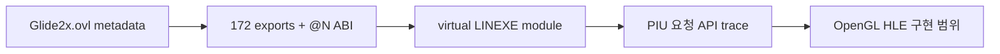

# Glide 2 OpenGL HLE 조사 작업 로그

`Glide2x.ovl`을 현재 analyzer로 검사하여 80386 LE, 3 object, 78 page, 3,419 internal fixup, import module 0개를 확인했습니다. resident-name table을 독립적으로 순회하여 module 이름 `glide2x`와 ordinal 1~172를 복원했습니다. decorated export의 `@N`으로 인자 byte 수를 얻을 수 있으므로, OVL 전체를 실행하지 않는 virtual LINEXE module과 동적 trap gate 설계가 가능함을 확인했습니다.

공식 Glide 2 문서와 Khronos OpenGL 자료를 대조하여 shader 기반 state translator를 권장안으로 정리했습니다. 기존 공개 Glide/wrapper source는 프로젝트 라이선스 정책상 통합하지 않고 clean-room behavioral reference로만 제한합니다. 이번 작업은 설계·분석 전용이며 코드와 실행 동작은 변경하지 않았습니다.

# Glide 2 OpenGL HLE Research Work Log

Analyzed `Glide2x.ovl` as an 80386 LE image with three objects, 78 pages, 3,419 internal fixups, and no imported modules. Independently walked the resident-name table and recovered module name `glide2x` plus ordinals 1 through 172. Decorated `@N` suffixes expose argument-byte counts, enabling a virtual LINEXE module and dynamic trap gates without executing the complete OVL.

Published Glide 2 documentation and Khronos OpenGL material support the recommended shader-based state translator. Existing public Glide or wrapper source remains a clean-room behavioral reference only. This task changes documentation and design only, not runtime behavior.
