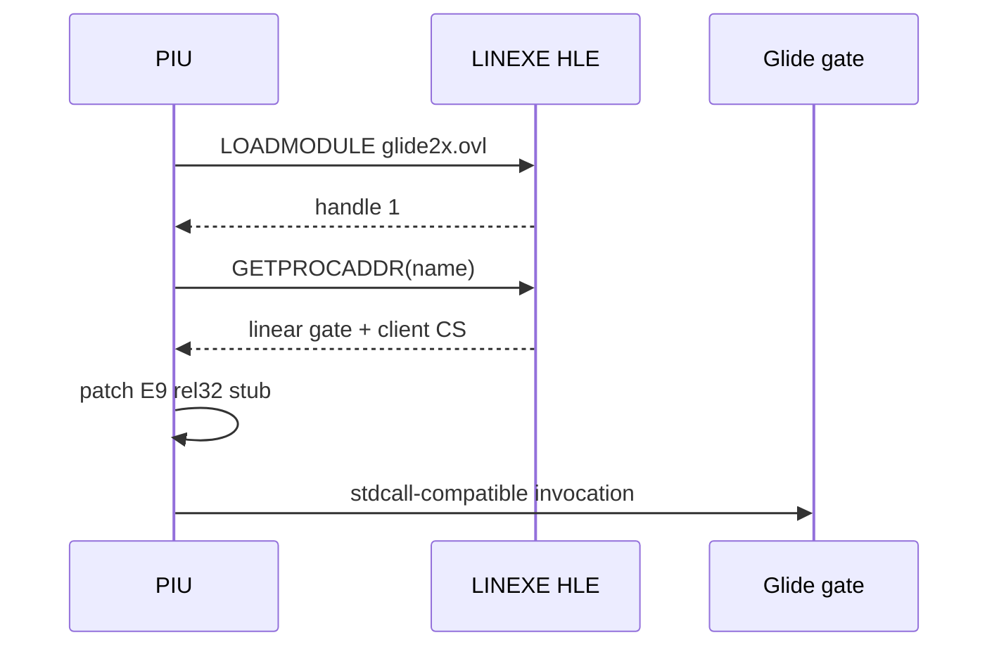

# LINEXE 가상 Glide module 작업 로그

`LOADMODULE("glide2x.ovl")`을 opaque handle `1`로 처리하고 서비스별 wrapper frame을 원자적으로 복원했습니다. 원본 bridge는 단순 12바이트 반환이 아니라 저장 ES와 wrapper register까지 포함한 ABI를 가지며, context에서 caller EIP/ESP를 직접 복원해야 Win32 SEH 경계를 안전하게 넘습니다.

LE resident-name parser를 추가하여 module 이름과 172개 ordinal export, decorated `@N` 인자 크기를 asset에서 읽습니다. `GETPROCADDR`는 존재하는 export에만 ordinal별 합성 gate를 배정합니다. 출력은 `{linear gate address, client CS}` 두 dword이며, PIU의 `C6/89` self-modifying near-jump patch를 지원하도록 일반 `C6 /0` byte store 의미도 추가했습니다.

동적 호출 순서는 `grGlideInit`, `grSstQueryHardware`, `grSstSelect(0)`, `grSstWinOpen`까지 진행했습니다. query는 공식 구조의 첫 field `num_sst=1`만 기록해 통과했고 미확인 hardware field는 합성하지 않았습니다. Win32 x86 Debug 빌드는 성공했습니다.

현재 `grSstWinOpen` 인자는 `hWnd=0`, resolution `7`, refresh `0`, color format `1`, origin `1`, color buffer `2`, auxiliary buffer `1`입니다. OpenGL backend를 열기 전에 windowed logical surface와 exclusive fullscreen 중 presentation 정책을 결정해야 합니다.

# LINEXE Virtual Glide Module Work Log

Implemented an opaque handle for `LOADMODULE("glide2x.ovl")` and atomic restoration of each observed wrapper frame. Added LE resident-name parsing for 172 ordinal exports and decorated `@N` argument sizes. `GETPROCADDR` now returns an eight-byte `{linear gate address, client CS}` result for asset-validated exports, and generic `C6 /0` byte stores allow PIU's self-modifying near-jump stubs.

Runtime execution reaches `grGlideInit`, `grSstQueryHardware`, `grSstSelect(0)`, and `grSstWinOpen`. Query succeeds with only documented `num_sst=1`; unknown hardware fields remain untouched. The Win32 x86 Debug build passed. The observed open arguments are `0,7,0,1,1,2,1`, making windowed logical presentation versus exclusive fullscreen the next decision.
