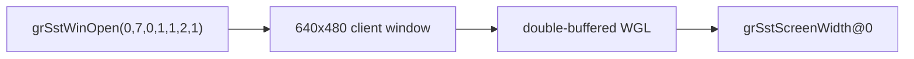

# Windowed Glide OpenGL backend 작업 로그

사용자가 선택한 1번 정책을 구현했습니다. PIU의 논리 640×480 해상도를 유지하면서 일반 resizable Win32 window, double-buffered WGL context와 auxiliary buffer 요청에 대응하는 24-bit depth pixel format을 생성합니다. 초기 framebuffer를 검정으로 clear/present하고 gate 진입마다 Win32 message를 pump합니다.

Glide 구현을 파일 단위로 분리했습니다. `glide_hle`는 export registry, gate image, ABI metadata와 논리 상태를 담당하고 `glide_opengl_backend`는 Win32/WGL/OpenGL 자원을 담당합니다. trampoline에는 guest ABI adapter만 남겼습니다. 같은 원칙을 다른 큰 기능에도 적용하도록 `AGENTS.md`와 coding style에 규칙을 추가했습니다.

Win32 x86 Debug 빌드가 성공했습니다. GUI supervisor 실행에서 window open count 1, 논리 크기 640×480, backend message `640x480 logical Glide window opened with WGL`을 확인했습니다. 다음 export는 float/x87 반환의 `_GRSSTSCREENWIDTH@0`이며 typed signature catalog가 다음 의사결정 지점입니다.

# Windowed Glide OpenGL Backend Work Log

Implemented the selected windowed policy: a normal resizable Win32 window preserving the 640×480 logical Glide surface, a double-buffered WGL context, and a 24-bit depth-capable pixel format for the requested auxiliary buffer. The initial framebuffer is cleared/presented and messages are pumped at gate boundaries.

Separated export/gate/state logic into `glide_hle` and Win32/WGL/OpenGL resources into `glide_opengl_backend`, leaving guest ABI adaptation in the trampoline. Added the same major-feature file-boundary rule to `AGENTS.md` and the coding style.

The Win32 x86 Debug build passed. GUI execution confirmed one 640×480 window open and the next export `_GRSSTSCREENWIDTH@0`, whose float/x87 return makes the typed signature catalog the next decision point.
