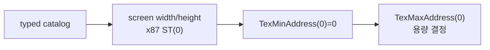

# 점진적 Glide signature catalog 작업 로그

실제 관찰된 Glide API에 대해 name, stack byte count와 반환 kind를 중앙 catalog에 추가했습니다. gate 호출 시 OVL resident export의 `@N` 값과 catalog를 교차 검증하며, catalog에 없는 함수는 stack/name/ordinal을 기록한 뒤 fail-closed합니다.

Win32 SEH `CONTEXT`에서 x87 TOP을 push하고 80-bit extended significand/exponent와 tag를 기록하는 helper를 별도 파일로 구현했습니다. `640.0f`와 `480.0f` 반환은 실제 PIU 실행에서 정상 소비됐습니다. 이어서 `grTexMinAddress(GR_TMU0)=0`까지 처리했고 다음 함수는 `grTexMaxAddress(GR_TMU0)`입니다.

Win32 x86 Debug 빌드와 GUI supervisor 실행이 성공했습니다. 다음 결정은 원본 PIU 1st의 Voodoo Banshee 근거와 Glide 2 texture allocator 호환성을 바탕으로 virtual TMU를 2 MiB 또는 4 MiB로 노출하는 정책입니다.

# Incremental Glide Signature Catalog Work Log

Added a central name, stack-byte-count, and return-kind catalog for observed Glide APIs. Gate calls cross-check catalog bytes against OVL `@N` metadata, while unknown signatures record their boundary and fail closed.

A separate Win32 helper pushes x87 values into an SEH `CONTEXT` by updating TOP, 80-bit significand/exponent storage, and tags. PIU successfully consumed `640.0f` and `480.0f`. Execution then handled `grTexMinAddress(GR_TMU0)=0` and reached `grTexMaxAddress(GR_TMU0)`.

## 후속 정정 / Later Correction

당시 진행 관찰만으로 x87 반환이 검증됐다고 판단한 것은 잘못이었습니다. 이후 `grClipWindow` caller 역추적으로 실제 ABI가 정수 EAX임을 확인하고 수정했습니다.

The earlier progression was insufficient evidence for x87 return correctness. Later `grClipWindow` caller tracing established and corrected the actual integer-EAX ABI.

The Win32 x86 Debug build and GUI supervisor run passed. The next decision is whether the virtual TMU exposes a conservative 2 MiB or expanded 4 MiB address space, considering PIU 1st's Voodoo Banshee hardware evidence and Glide 2 allocator compatibility.
