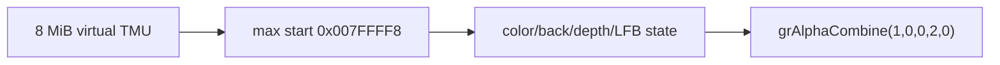

# Glide 8 MiB virtual TMU 작업 로그

사용자 결정에 따라 TMU 0의 guest-visible address space를 8 MiB로 설정했습니다. 공용 helper는 byte count에서 마지막 8-byte aligned texture start를 계산하며 `grTexMaxAddress(GR_TMU0)`은 `0x007FFFF8`을 반환합니다. OpenGL texture object는 후속 download 시 lazy 생성하므로 이 값은 host GPU 연속 할당량이 아닙니다.

typed catalog를 확장하여 color mask, render buffer, depth mask, Z-buffer mode와 LFB color format을 처리했습니다. 직접 대응 가능한 상태는 분리된 Win32 OpenGL backend에서 적용하고 LFB format은 플랫폼 공용 Glide state에 보존합니다.

Win32 x86 Debug 빌드와 반복 GUI supervisor 실행이 성공했습니다. 다음 frontier는 `grAlphaCombine`이며 shader 기반 combine compiler와 legacy fixed-function 근사 중 renderer 정책 결정이 필요합니다.

# Glide 8 MiB Virtual TMU Work Log

Configured an 8 MiB guest-visible TMU 0 range. Shared logic calculates the last 8-byte-aligned texture start, making `grTexMaxAddress(GR_TMU0)` return `0x007FFFF8`. OpenGL texture objects remain lazily allocated on download, so this is not an eager contiguous GPU allocation.

Extended the typed catalog through color mask, render buffer, depth mask, Z-buffer mode, and LFB color format. Direct state is applied by the separated Win32 OpenGL backend while LFB format remains in shared Glide state.

The Win32 x86 Debug build and repeated GUI supervisor runs passed. The next frontier is `grAlphaCombine`, requiring a shader-based combine compiler versus legacy fixed-function approximation decision.
