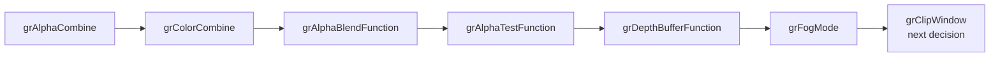

# Glide GLSL combine pipeline 작업 로그

공용 alpha/color combine과 초기 raster state를 추가하고, 별도 Win32 `GlideOpenGlShader`에서 GLSL 1.10 program을 compile/link하여 uniform으로 적용했습니다. WGL context와 shader 생명주기를 연결했으며 `ONE/ZERO` blending, `ALWAYS` alpha/depth compare, fog disabled를 OpenGL 상태로 변환했습니다.

live telemetry version 3은 마지막 Glide ordinal과 다섯 인자를 공유합니다. 이를 통해 alpha/color combine, alpha blend, alpha test, depth compare, fog를 차례로 통과하고 다음 frontier `_GRCLIPWINDOW@16`을 확인했습니다.

Win32 x86 Debug 빌드는 성공했습니다. 기존 검증 프로세스가 EXE를 잠근 환경에서는 별도 output directory를 사용했고, 기본 `repiu_exe.lib`를 먼저 갱신해야 새 loader가 최신 코드를 링크한다는 점도 확인했습니다. 최종 실행은 `_GRCLIPWINDOW@16(0,0,0x030FED90,0x030FED8B)`에서 fail-closed했습니다. 뒤의 값들이 guest code 주소이므로 producer/ABI 역추적 전까지 구현하지 않습니다.

# Glide GLSL combine pipeline work log

Added shared alpha/color combine and initial raster state, with a separate Win32 `GlideOpenGlShader` compiling/linking one GLSL 1.10 program and applying uniforms. Shader lifetime follows the WGL context. The backend translates `ONE/ZERO` blending, `ALWAYS` alpha/depth comparisons, and disabled fog.

Live telemetry version 3 shares the last Glide ordinal and five arguments. Win32 x86 Debug builds passed, and runtime observation progressed through combine, blend, tests, and fog to `_GRCLIPWINDOW@16(0,0,0x030FED90,0x030FED8B)`. The last values are guest-code addresses, so the boundary remains fail-closed pending producer/ABI tracing.
