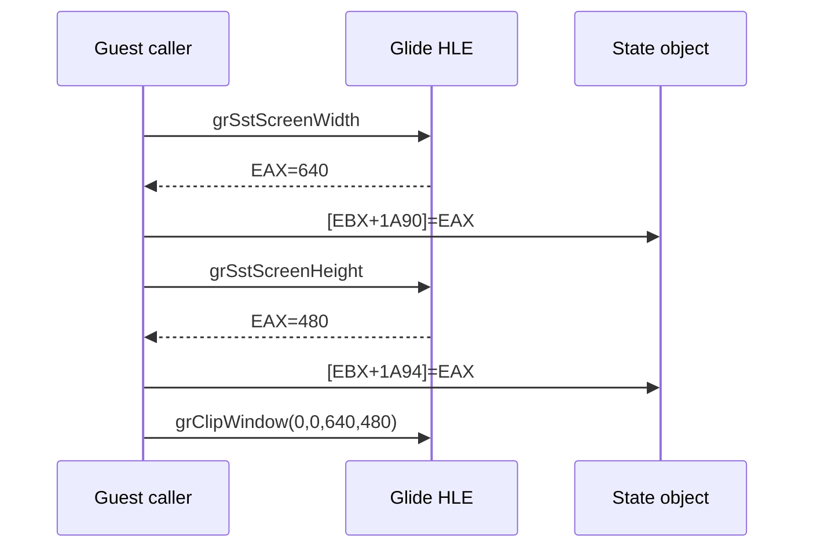

# Glide clip window ABI 역추적 작업 로그

live telemetry version 5에 Glide ordinal, ESP, EBX/ECX/EDX와 여덟 stack dword를 추가했습니다. `grClipWindow` return EIP `0x0304F7AF`의 원본 caller를 복원한 결과 stack ABI는 정상이었고 width/height 필드가 import stub 주소로 채워진 원인은 잘못된 x87 반환이었습니다.

typed signature를 `UInt32/EAX`로 수정하자 clip 좌표가 `0,0,0x280,0x1E0`으로 복원됐습니다. 전체 화면 clip은 OpenGL viewport/scissor로 적용하고 cull mode 0은 culling disabled로 처리했습니다. Win32 x86 Debug 빌드와 실제 asset 실행을 반복 검증했으며 다음 frontier는 `_GRGLIDEGETSTATE@4(0x0383E180)`입니다.

# Glide Clip Window ABI Trace Work Log

Live telemetry version 5 now publishes Glide ordinal, ESP, EBX/ECX/EDX, and eight stack dwords. Reconstructing the caller at return EIP `0x0304F7AF` proved the stack ABI valid and identified the x87-only return as the cause of import-stub addresses entering width/height fields.

Correcting the typed signatures to `UInt32/EAX` restored `grClipWindow(0,0,0x280,0x1E0)`. The validated full-window clip maps to OpenGL viewport/scissor, cull mode zero disables culling, Win32 x86 Debug builds and asset runs passed, and the next frontier is `_GRGLIDEGETSTATE@4(0x0383E180)`.
