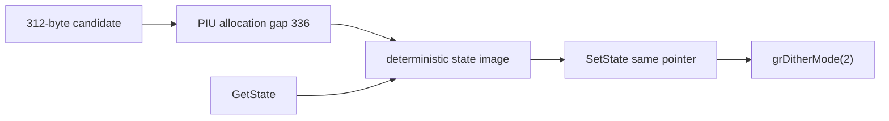

# Glide state blob 교차 검증 작업 로그

공개 Glide 문서, 호환 구현의 312바이트 후보, PIU allocation과 consumer를 교차 검증했습니다. DOS/32A에는 관련 Glide state 근거가 없음을 확인했으며 코드는 복사하거나 통합하지 않았습니다.

PIU buffer `0x0383E180`과 다음 allocation `0x0383E2D0`의 336바이트 간격이 312바이트 payload 후보를 지지합니다. 실제 실행은 같은 포인터로 `grGlideGetState` 후 즉시 `grGlideSetState`를 호출하며 중간 Glide gate나 직접 blob 접근이 없습니다.

플랫폼 중립 `BuildGlideStateImage`와 `ParseGlideStateImage`를 구현하고 magic/version, 논리 상태 필드, 0으로 채운 미확인 영역을 사용했습니다. Win32 x86 Debug 빌드와 실제 asset 실행에서 round-trip을 통과했으며 다음 frontier는 `_GRDITHERMODE@4(2)`입니다.

# Glide State Blob Cross-Validation Work Log

Cross-validated public Glide documentation, the independent 312-byte Glide2 compatibility candidate, PIU allocation spacing, and the original consumer. DOS/32A contains no Glide-state evidence and no external code was copied or integrated.

The 336-byte gap from PIU's state buffer to the next allocation corroborates a 312-byte payload plus allocator overhead/alignment. PIU immediately performs a same-pointer Get/Set round-trip without an intervening Glide gate or direct blob access. Implemented deterministic platform-neutral serialization and validation, passed Win32 x86 Debug build and asset execution, and reached `_GRDITHERMODE@4(2)`.
