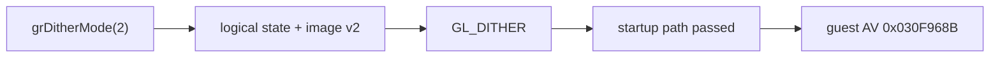

# Glide host dithering 정책 작업 로그

관찰된 `grDitherMode(2)`를 공용 logical state와 312-byte state image version 2에 보존하고 Win32 backend에서 `GL_DITHER` 활성화로 처리했습니다. 다른 mode는 fail-closed합니다.

Win32 x86 Debug 빌드가 성공했습니다. 실제 asset 실행은 dither 호출을 통과하고 미구현 Glide gate가 아닌 원본 guest `EIP=0x030F968B` 접근 위반까지 진행했습니다.

원본 Voodoo 16-bit ordered dithering과의 픽셀 동일성은 아직 검증되지 않았습니다. mode-2 matrix, PIU color quantization과 reference capture를 확보한 뒤 GLSL ordered dithering을 구현하는 TODO를 코드와 설계 문서에 남겼습니다.

# Glide Host Dithering Policy Work Log

Persisted observed `grDitherMode(2)` in shared logical state and 312-byte state-image version 2, and enabled host `GL_DITHER` in the Win32 backend. Other modes fail closed. Win32 x86 Debug built successfully, and asset execution passed the dither call before reaching a later original-guest access violation at `0x030F968B`, not an unimplemented Glide gate.

Pixel identity with Voodoo 16-bit ordered dithering is unverified. Code and design retain a TODO for GLSL ordered dithering after confirming the mode-2 matrix, PIU quantization, and a trustworthy reference capture.
