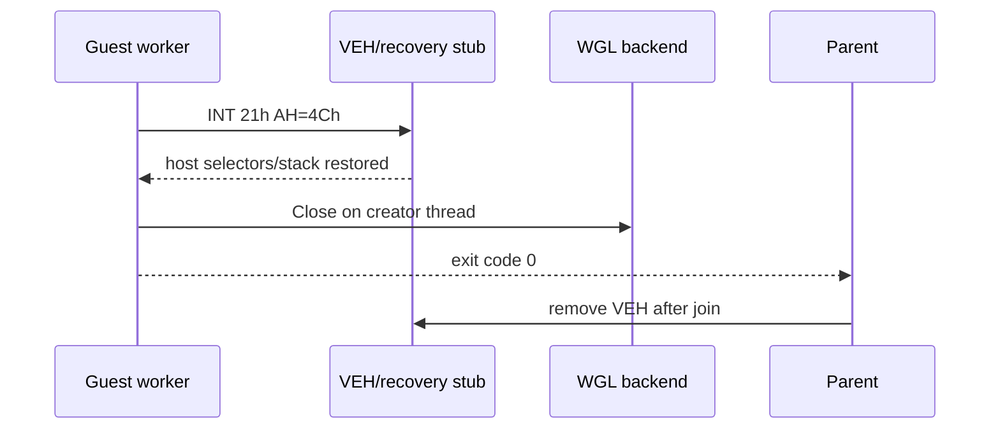

# Host 복귀와 guest stream logging 작업 로그 / Work Log

## 한국어

host selector는 진입 시 전역 recovery slot에 저장하고 복귀 stub에서 `CS:` override로 읽도록 변경했습니다. 복귀 직후 host single-step은 TF를 제거하고 계속 실행합니다. WGL context와 window는 생성한 guest worker가 host 복귀 직후 닫고, parent는 join 뒤 VEH를 제거합니다.

DOS `AH=09h`와 `AH=40h/BX=1`을 stdout, `AH=40h/BX=2`를 stderr로 분리하고 실행 파일 basename의 spdlog logger로 줄 단위 출력하도록 변경했습니다. stdout은 `info`, stderr는 `error`입니다.



Win32 x86 Debug 빌드가 성공했습니다. 40초 PIU 실행은 약 28초에 정상 복귀했으며 supervisor는 `child_exit=0`, loader는 `thread exit code: 0`, `exception caught: false`, `timed out: false`를 기록했습니다. 잔류 rePIU 프로세스는 없었습니다. guest stream은 `stdout/stderr bytes: 0/23`으로 분류됐고 다음 원본 stderr가 출력됐습니다.

```text
[error] [PIU.EXE] ERROR: Not PTX file
```

CTest target은 구성되어 있지 않아 `No tests were found`를 반환했습니다.

`dos4gw_hello` 회귀 실행은 `stdout/stderr bytes: 15/0`, thread exit code 0을 기록하고 다음 stdout/info 로그를 출력했습니다.

```text
[info] [hello.exe] Hello, world!
```

## English

Host selectors are saved to global recovery slots before guest entry and read with a `CS:` override by the recovery stub. A residual host-side single-step clears TF and continues. The guest worker closes its WGL context and window after host recovery; the parent removes the VEH after joining.

DOS `AH=09h` and `AH=40h/BX=1` are stdout, while `AH=40h/BX=2` is stderr. Output is split into lines and logged through a basename logger at `info` and `error`, respectively.

The Win32 x86 Debug build succeeded. A 40-second PIU run returned normally after about 28 seconds with supervisor `child_exit=0`, loader thread exit code 0, no caught exception, no timeout, and no residual rePIU process. The guest emitted 0 stdout bytes and 23 stderr bytes: `[error] [PIU.EXE] ERROR: Not PTX file`. The `dos4gw_hello` regression emitted 15 stdout bytes, no stderr, and `[info] [hello.exe] Hello, world!`, with thread exit code 0. CTest reported that no tests are configured.
