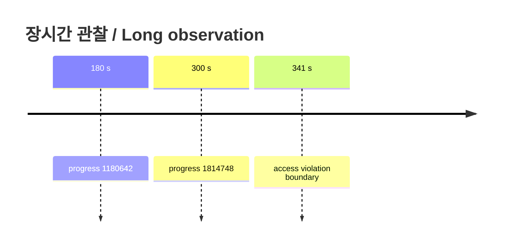

# 단계적 장시간 실행 관찰 / Progressive Long Runtime Observation

3분 실행은 progress `364644 -> 1180642`, 5분 실행은 `544230 -> 1814748`로 증가했으며 guest fatal은 없었습니다. 10분 목표 관찰은 약 341초에 host 접근 위반으로 중단됐습니다. hidden supervisor와 redirect log로 foreground 도구 제한과 guest 종료를 구분했습니다.

The 3-minute run progressed from `364644` to `1180642`, and the 5-minute run from `544230` to `1814748`, without a guest fatal. The attempt toward ten minutes stopped at a repeatable host access violation near 341 seconds. A hidden supervisor with redirected logs distinguished it from the foreground tool lifetime.

