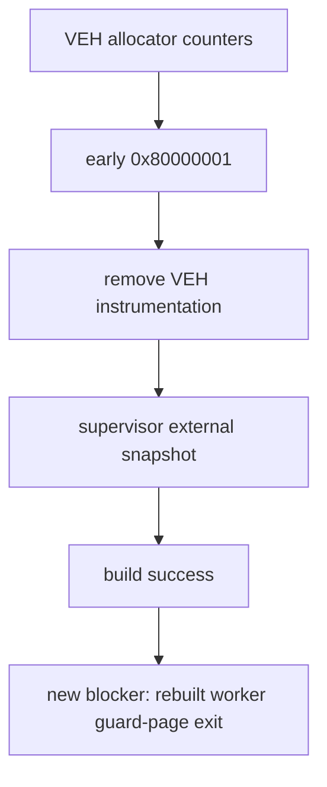

# Arena allocator high-water 관찰 결과 / Result

allocator request/commit을 VEH에서 직접 누적하는 첫 구현은 초기 `0x80000001` 회귀를 만들었습니다. 공유 구조체 확장, worker context 필드 확장, hot-path interlocked 게시를 각각 제거해 비교했으며 VEH 내부 계측은 최종 코드에 남기지 않았습니다.

대신 supervisor가 `last_guest_eip == 0x030873F4`일 때 child process의 `ESI+0x34`를 `VirtualQueryEx`와 `ReadProcessMemory`로 외부 확인하도록 구현했습니다. 빌드는 성공했습니다. 그러나 짧은 회귀 실행이 약 0.4~0.8초에 `child_exit=0x80000001`로 종료되어 341초 allocator 경계까지 재도달하지 못했습니다.

The first in-VEH allocator request/commit counters caused an early `0x80000001` regression. Shared-layout growth, worker-context growth, and hot-path publishing were removed from the final code. The supervisor instead queries the child externally at `0x030873F4`. The build succeeds, but short runs of the rebuilt worker terminate around 0.4–0.8 seconds with `0x80000001`, preventing a return to the 341-second allocator boundary.
