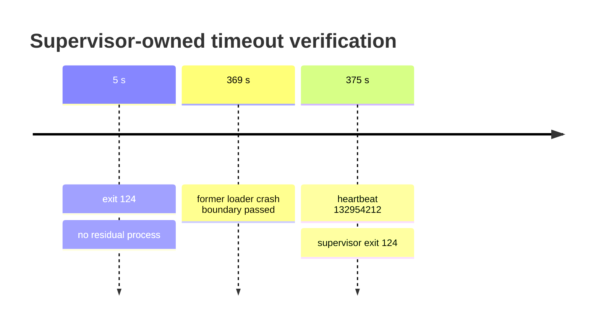

# Supervisor 전담 timeout 결과 / Result

loader 환경 값 `0`을 `INFINITE`로 해석하고 wall-clock/quiet timeout을 모두 비활성화했습니다. supervisor는 항상 loader에 `0`을 전달하고 자체 제한에서 process 전체를 종료합니다.

5초 검증은 loader `timeout: disabled`, supervisor `child_exit=124 terminated=true`로 완료됐습니다. 375초 검증은 이전 369초 loader teardown 경계를 통과했으며 heartbeat `132,954,212`, dispatch `66,477,106/66,477,106`까지 증가했습니다. 종료는 supervisor의 exit 124였고 잔류 process가 없었습니다.

Loader environment value zero now maps to `INFINITE`, disabling wall-clock and quiet timeouts. The supervisor passes zero and owns process termination. Both the five-second and 375-second runs ended with supervisor exit 124, no residual process, and no former loader teardown crash.
