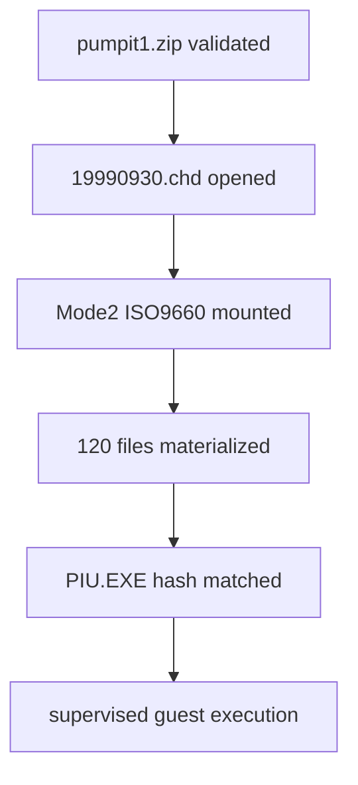

# pumpit1 CHD mount 결과 / Result

`roms/`를 Git ignore에 추가하고 `pumpit1` target profile을 등록했습니다. BSD 3-Clause libchdr v0.3.0을 pinned source로 도입했으며 project-owned reader가 CHD v5 Mode2 raw sector에서 ISO9660 tree를 materialize합니다.

실제 asset 검증 결과 120개 파일과 약 13.7MB가 mount cache에 생성됐습니다. mounted `PIU.EXE`와 `DOS4GW.EXE`는 기존 분석본과 SHA-256이 일치합니다. analyzer는 `pumpit1` profile에서 LE image를 정상 분석했고, 두 번째 실행은 CHD identity marker를 통해 cache를 재사용했습니다.

10초 supervisor 실행은 `build/runtime_mounts/pumpit1`을 DOS VFS root, `\PIU`를 current directory로 사용해 정상 진행한 뒤 supervisor exit 124로 종료됐습니다.

Added the ignored ROM root and the `pumpit1` profile. Pinned libchdr v0.3.0 decodes CHD hunks, while the project-owned ISO9660 reader materializes 120 files. Executable hashes match the established assets, analyzer succeeds, cache reuse works, and a ten-second supervised run progresses using the CHD-derived VFS root.
