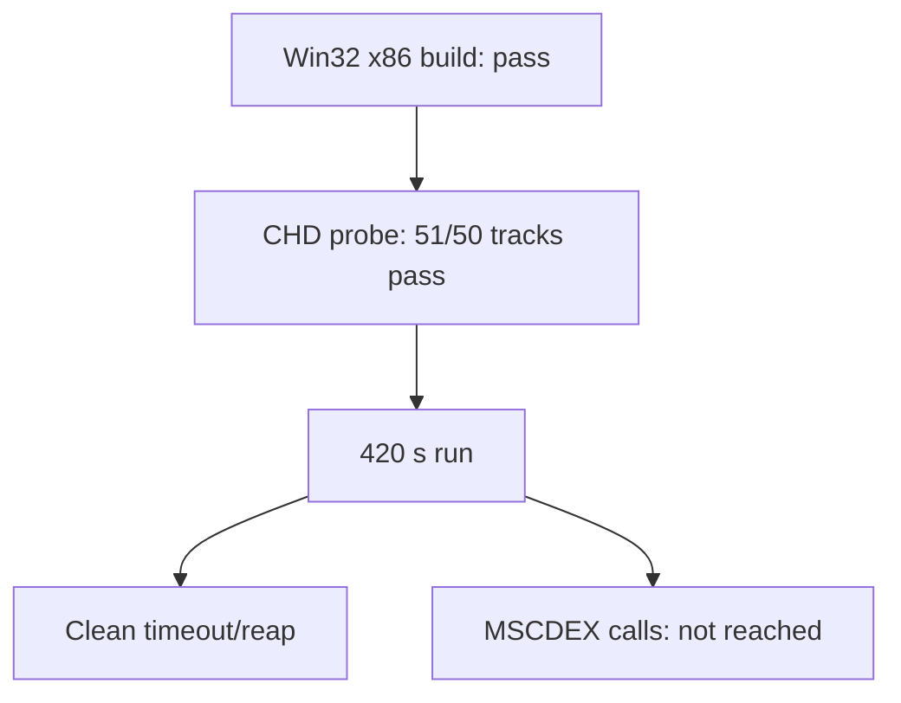

# MSCDEX CHD CD 오디오 및 Glide trace 작업 로그

공용 CHD CD image reader, MSCDEX interrupt/request adapter, Win32 waveOut CD-DA backend, Glide ordinal 누적 trace를 구현했습니다. `pumpit1` mount의 CHD 경로만 해당 실행에 전달하며 다른 프로파일은 기존 no-drive 동작을 유지합니다.

실제 CHD probe는 51개 track(1 data, 50 audio)의 첫 raw sector를 모두 읽었고 lead-out 258607을 확인했습니다. Win32 x86 Debug loader, supervisor, analyzer, CHD probe를 빌드했습니다. 420초 supervisor 실행은 timeout exit 124로 전체 child를 회수했고 잔류 process가 없었습니다. 실행은 알려진 decode 구간에 머물러 MSCDEX 호출은 0회였으므로 실제 PIU play packet과 audible output은 미확정입니다.

# MSCDEX CHD CD Audio and Glide Trace Work Log

Implemented a shared CHD reader, MSCDEX adapter, Win32 waveOut CD-DA backend, and accumulated Glide tracing. The real probe read all 51 track starts. Win32 x86 Debug targets built successfully. A 420-second run was fully reaped with exit 124 and no residual process, but made no MSCDEX call, leaving the concrete PIU play packet and audible-output check unresolved.
