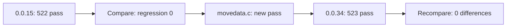

# OpenWatcom sample baseline 0.0.34 갱신 작업 로그

현재 0.0.34 Win32 x86 loader와 로컬 OpenWatcom 설치로 `clibexam`, `cplbexam` 819개 sample을 다시 빌드하고 실행했습니다.

## 결과

* 전체: 819
* build pass: 793
* build skip: 26
* run/overall pass: 523
* overall pass rate: 63.9%
* 이전 baseline 0.0.15 대비 regression: 0
* new pass: `clibexam/movedata.c` 1개
* 갱신 후 0.0.34 baseline 재비교: regression/new pass/new sample/missing 모두 0
* 잔류 `repiu` process: 없음

생성 또는 갱신된 추적 파일:

* `tests/baselines/openwatcom_samples.json`
* `tests/history/openwatcom_samples/20260712-191219-0.0.34.json`
* `tests/history/openwatcom_samples/20260712-191219-0.0.34.html`

host와 819개 sample build는 모두 완료되어 manifest가 생성됐습니다. orchestration command의 140초 제한과 완료 시점이 겹쳐 shell exit 124가 기록됐지만 출력은 `[819/819]`와 manifest 경로까지 도달했습니다. 이어진 세 차례 819개 실행(compare, update, final compare)은 모두 exit 0으로 완료됐습니다.

# OpenWatcom Sample Baseline 0.0.34 Refresh Work Log

Rebuilt and ran all 819 local `clibexam` and `cplbexam` samples with the current 0.0.34 Win32 x86 loader. Compared with baseline 0.0.15, there were no regressions and `clibexam/movedata.c` became one new pass, raising the total from 522 to 523 (63.9%). Updated the tracked baseline and added dated JSON/HTML history. A final comparison against 0.0.34 reported zero regressions, new passes, new samples, or missing samples, with no residual rePIU process.
