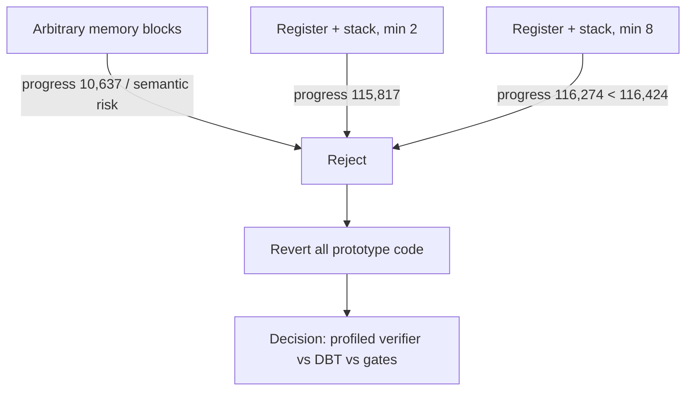

# 공용 native basic-block fast path 실험 작업 로그

Zydis로 현재 EIP부터 control boundary까지 직선 block을 검증하고 DR0 breakpoint로 native 실행하는 EXE 독립 prototype을 구현해 세 차례 조정했습니다.

* Win32 x86 build는 각 prototype에서 성공했습니다.
* 첫 prototype은 sensitive `REP CMPSB` boundary 처리 문제로 조기 종료해 즉시 폐기했습니다.
* sensitive boundary를 거부한 뒤 crash는 없어졌지만 임의 memory 허용은 guest progress 의미를 바꿀 위험이 확인됐습니다.
* SS-stack만 허용한 최소 2/8 instruction 정책은 기존 성능을 넘지 못했습니다.
* 모든 code/telemetry 변경을 되돌려 tracked source가 작업 시작 커밋과 동일함을 확인했습니다.
* OpenWatcom baseline은 채택할 code가 없으므로 재실행하지 않았습니다.

# Generic Native Basic-Block Fast Path Experiment Work Log

Built an executable-independent Zydis/DR0 straight-line block prototype and iterated through arbitrary-memory and register/SS-stack policies. The arbitrary-memory variant changed progress semantics; conservative variants reached 115,817 and 116,274 versus the existing 116,424 and provided no benefit. All prototype source and telemetry changes were reverted. The next decision is runtime-profiled indirect-target function verification, DBT, or patched/guarded HLE gates.
