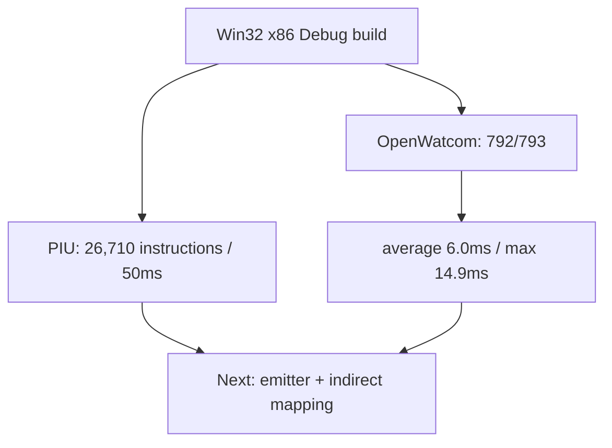

# AOT 변환 계획 prototype 작업 로그

플랫폼 공용 `AotTranslationPlan`, Zydis CFG analyzer, `repiu_aot_probe`를 구현했습니다. 원본 실행 경로는 변경하지 않았습니다.

검증:

* `repiu_aot_probe` Win32 x86 Debug build 성공
* mounted PIU.EXE와 MASTER PIU.EXE에서 동일한 초기 image를 분석
* PIU full fallthrough CFG: blocks 6,695, instructions 26,710, elapsed 50,136us
* OpenWatcom built EXE: 792 성공, 1 제외, 평균 5,983.9us, 최대 14,854us
* 제외: `clibexam_exec_c`, LE mapped object 없음
* 실행/loader 동작은 바꾸지 않아 OpenWatcom runtime baseline은 갱신하지 않음

# AOT Translation Plan Prototype Work Log

Implemented the platform-neutral AOT plan, Zydis CFG analyzer, and `repiu_aot_probe` without changing execution. The PIU plan covered 26,710 instructions in 6,695 blocks in about 50ms. The probe succeeded for 792 of 793 built OpenWatcom executables with a 6.0ms average and 14.9ms maximum; the excluded executable had no mapped LE object. The next phase is byte emission, HLE stubs, and indirect guest/code-cache mapping.
