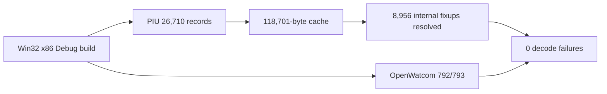

# AOT 코드 캐시 emitter 작업 로그

instruction 단위 AOT 계획 레코드와 플랫폼 공용 code-cache emitter를 추가했습니다. 일반 명령과 return은 원본 byte를 보존하고 direct call/jump/Jcc는 rel32로 정규화한 뒤 두 번째 pass에서 cache offset으로 해결합니다. HLE, 간접 분기, rel32로 직접 표현할 수 없는 LOOP 계열은 `INT 3` sentinel과 외부 fixup metadata로 남겼습니다.

검증 결과:

* `repiu_aot_probe`, `repiu_loader_win32` Win32 x86 Debug 빌드 성공
* PIU: cache 118,701 bytes, map 26,710 entries, direct/fallthrough fixup 8,956개 해결
* PIU: external fixup 398 = HLE 332 + indirect 48 + unsupported conditional 18
* OpenWatcom: mapped LE 792개 성공, 기존 비-mapped 표본 1개 제외
* OpenWatcom: internal fixup 931,644개 해결, external fixup 61,986개, unsupported conditional 96개
* OpenWatcom: decode failure 0, 평균 cache 생성 7,847.2us, 최대 22,505us
* 생성물은 의도적으로 `executable=false`; 원본 loader 실행 경로는 변경하지 않음

# AOT Code Cache Emitter Work Log

Added instruction-level plan records and a platform-neutral two-pass emitter. It preserves ordinary/return bytes, normalizes direct control flow and explicit fallthrough edges to rel32, resolves internal cache targets, and represents HLE, indirect, and LOOP-family boundaries as explicit INT3 sentinel fixups. PIU emitted 118,701 bytes with all 8,956 internal fixups resolved and zero decode failures. All 792 mapped OpenWatcom samples also passed emission and decode verification. The image deliberately remains non-executable until the execution ABI is implemented.
