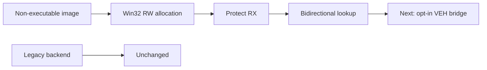

# 선택 가능한 AOT 실행 backend 준비 작업 로그

이번 작업에서는 실제 trampoline 연결 전에 필요한 안전 경계를 구현했습니다.

* 모든 return을 `INT 3` dispatcher sentinel로 emit
* Win32 code cache를 별도 `aot_code_cache_win32.*` 파일로 분리
* RW allocation → byte copy → RX protection → instruction-cache flush 적용
* cache→guest와 guest→cache lookup 구현
* probe에서 PIU entry round-trip 검증 성공
* `repiu_aot_probe`, `repiu_loader_win32` Win32 x86 Debug 빌드 성공
* 기존 trampoline과 legacy backend는 변경하지 않음

PIU 결과는 cache 118,615 bytes, map 26,710개, 내부 fixup 8,956개, 외부 dispatcher 경계 1,003개, decode failure 0입니다.

# Selectable AOT Execution Backend Preparation Work Log

Implemented the safety foundation for a selectable backend: returns are dispatcher sentinels, the isolated Win32 placement performs RW-copy-to-RX protection and cache flushing, and bidirectional entry lookup passes for PIU. The legacy trampoline remains untouched. Actual opt-in VEH bridging is the next task.

## 181-B opt-in 실행 연결

`REPIU_EXECUTION_BACKEND=aot`를 추가하고 기본값은 `legacy`로 유지했습니다. cache breakpoint를 guest 주소로 복원해 기존 single-step/HLE dispatcher에 전달하고, 처리 뒤 cache target을 찾으면 TF를 지우고 재진입합니다. target이 없으면 기존 single-step backend를 활성화합니다.

PIU 5초 실행은 예외 없이 timeout까지 진행됐으며 AOT entry/boundary/reentry/fallback은 `1/8/7/1`이었습니다. fallback 주소는 `0x040FB6B5`입니다. legacy와 AOT prototype의 progress는 각각 85,734와 85,736으로 동일 수준이며, 이는 첫 runtime-generated target 이후 legacy로 실행했기 때문입니다.

## 181-B Opt-in Execution Bridge

Added `REPIU_EXECUTION_BACKEND=aot` while retaining legacy as the default. Cache breakpoints reuse the existing guest dispatcher, successful targets re-enter the cache with TF cleared, and missing targets explicitly enable legacy single-step. PIU ran for five seconds without an exception, but fell back at runtime-generated address `0x040FB6B5`; performance therefore remains equivalent to legacy until on-demand translation is added.
