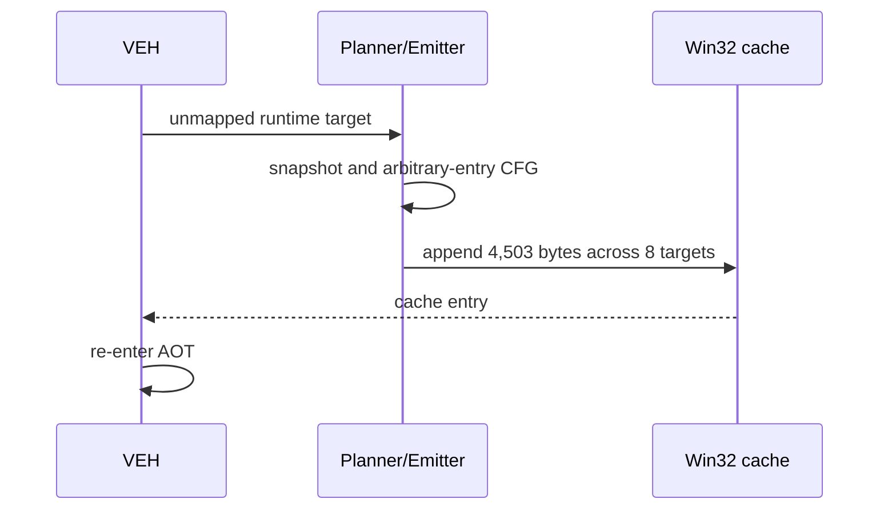

# Runtime AOT on-demand translation 작업 로그

arbitrary-entry planner, 16MB 예약 cache, live arena snapshot, 동적 image append와 telemetry를 구현했습니다. cache append는 RW 전환, byte/map 병합, RX 복원, instruction-cache flush 순서로 수행됩니다.

검증:

* Win32 x86 Debug `repiu_loader_win32`, `repiu_aot_probe` 빌드 성공
* static `aot`: 1초 timeout, 예외 없음, dynamic attempt 0, legacy fallback 유지
* experimental `aot-dynamic`: dynamic attempt/success 8/8, 4,503 bytes 추가
* selector 0 low-memory byte/word/dword read 추가 후 `ES:[0]` 비교 경계 통과
* 다음 blocker: guest `FF D0` indirect call의 실행 전 target translation

안전한 비교를 위해 backend는 세 가지로 분리됩니다.

* `legacy`: 기존 기본 실행
* `aot`: 정적 cache 후 미매핑 target에서 legacy fallback
* `aot-dynamic`: on-demand append와 간접 dispatcher 개발용 실험 모드

# Runtime AOT On-Demand Translation Work Log

Implemented arbitrary-entry planning, a reserved appendable cache, live arena snapshots, W^X dynamic appends, and telemetry. Eight PIU runtime targets appended 4,503 bytes successfully. Selector-zero low-memory reads passed the next segment boundary. The remaining blocker is pre-execution resolution of `FF D0` indirect calls. Stable legacy and static-AOT modes remain intact; dynamic translation is isolated behind `aot-dynamic`.
