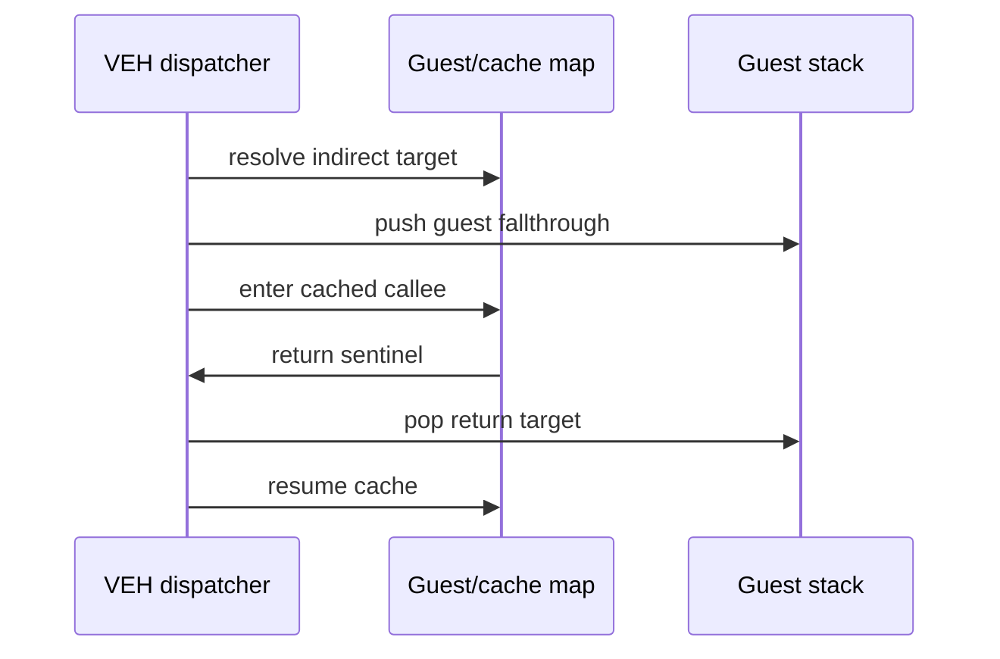

# AOT indirect transfer dispatcher 작업 로그

near indirect call/jump와 return을 cache sentinel에서 실행 전에 처리하도록 구현했습니다.

* `FF /2`, `FF /4` register 및 ModRM memory target 계산
* guest target map 또는 dynamic append
* indirect call 시 guest fallthrough을 guest stack에 push
* `C3/C2` return target을 stack에서 읽고 cache로 dispatch
* source/target 및 dispatch count telemetry 추가

검증 결과:

* Win32 x86 Debug loader 빌드 성공
* stable `aot`: 1초 실행 예외 없음, 기존 fallback 유지
* `aot-dynamic`: indirect dispatch 7회, return dispatch 8회 성공
* 다음 예외는 guest가 아닌 `ntdll` 내부에서 발생
* 동적 변환의 VEH/guest-stack 내 heap 작업을 host-safe worker 경계로 이동할 필요가 있음

# AOT Indirect Transfer Dispatcher Work Log

Implemented pre-execution dispatch for near indirect calls/jumps and returns, including guest return preservation and telemetry. Seven indirect calls and eight returns succeeded in PIU. Stable AOT remains exception-free. The experimental dynamic path next failed inside `ntdll`, motivating a host-stack worker boundary for snapshot, planning, and cache mutation.
