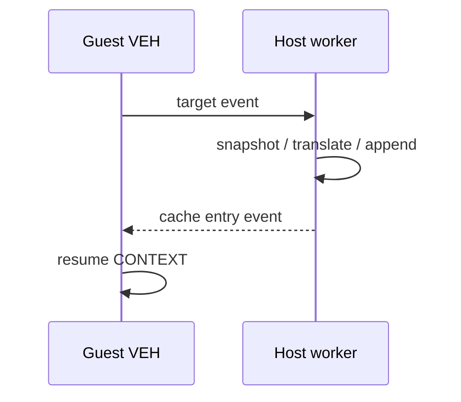

# Host-stack AOT translation worker 작업 로그

dynamic translation의 heavy work를 guest VEH에서 별도 Win32 worker로 이동했습니다.

* request/completion auto-reset event 생성
* 단일 target request 직렬화
* worker host stack에서 snapshot, plan, emit, cache append 수행
* VEH는 primitive result만 읽어 CONTEXT EIP 갱신
* 정상 종료, timeout, thread 생성 실패에서 shutdown/join
* supervisor debug mode에서 access violation first-chance context 출력 보강

검증 결과 worker 전후 동일한 return stack divergence가 재현돼 host-stack 이동 자체는 오류를 제거하지 않았습니다. 추가로 Zydis operand의 segment-register class를 HLE boundary로 분류하고 direct call을 `push guest return; jmp cache target`으로 변경했습니다. PIU cache는 118,367 bytes, HLE boundary 603개, decode failure 0입니다.

현재 frontier는 `RET 0x030F8460`이며 ESP의 네 번째 dword에 올바른 guest continuation이 남습니다. 다음 작업은 legacy/AOT differential ring trace입니다.

# Host-Stack AOT Translation Worker Work Log

Moved snapshot/planning/emission/cache mutation to a serialized Win32 worker with event-based request/completion and complete shutdown handling. The identical return-stack divergence before and after the move rejects the in-VEH allocation hypothesis. Segment-register operands are now HLE boundaries and direct calls uniformly push guest return addresses. The current frontier requires a legacy/AOT differential ring trace around `RET 0x030F8460`.
