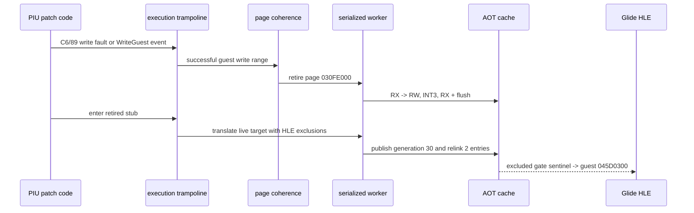

# AOT self-modifying page 일관성 작업 로그

## 목표와 결과

PIU가 LINEXE GETPROCADDR 결과로 import stub을 수정한 뒤에도 AOT가 변경 전
resolver cache entry를 재사용해 같은 조회를 반복하던 문제를 일반 page-generation
일관성 정책으로 해결했습니다. 정상 경로는 새 generation을 발행하고, 안전한
재번역을 보장할 수 없는 page만 legacy quarantine하는 정책입니다.

확인된 PIU 결과는 다음과 같습니다.

| 항목 | 수정 전 10초 | 수정 후 10초 |
|---|---:|---:|
| GETPROCADDR | 19,611 | 1 |
| Glide gate entry | 0 | `0x20`, `0x2D` ordinal 진행 |
| code write | 0 | 2 |
| page retirement | 0 | 1 |
| generation publish | 0 | 1 |
| stale entry relink | 0 | 2 |
| generation failure / quarantine | 0 / 0 | 0 / 0 |
| heartbeat | 반복 resolver 경로 | 약 2.28 million |

발행된 generation ID는 30이었습니다. 앞선 29개 값은 일반 dynamic translation이
사용한 전역 generation이고, SMC page의 첫 재번역이 30으로 기록된 것입니다.

## 구현

* immutable hot address map과 별도로 active/generation metadata를 유지했습니다.
* translated instruction이 있는 guest page와 map index를 page 단위로 색인했습니다.
* native guest/cache store는 RX page write fault와 Trap Flag 완료로 관찰하고,
  `WriteGuest*` helper도 성공한 write를 같은 정책에 보고합니다.
* serialized worker가 active cache entry를 `INT3`로 retire하고 cache-to-guest
  provenance는 유지합니다.
* 다른 page에서 수정된 retired page로 다음에 들어갈 때 live arena snapshot에서
  reachable CFG를 다시 만들고 새 generation을 append합니다.
* 5바이트 이상 stale entry는 `E9 rel32`로 최신 generation에 forwarding하고,
  짧은 entry는 provenance trap으로 남깁니다.
* LINEXE/Glide gate arena를 HLE-owned excluded range로 전달해 합성 gate byte를
  일반 AOT code로 복사하지 않습니다.
* page index/state, retirement, write-watch 보호 전환을
  `aot_page_coherence_win32` 전용 header/source로 분리했습니다.



## 추가로 확인한 문제

첫 generation 구현은 patched stub의 `E9` target을 따라 합성 Glide gate
`0x045D0300`의 `0F 0B 20 00`을 cache에 복사했습니다. 이 때문에 cache에서
`0xC000001D` illegal instruction이 발생했습니다. cache-to-guest provenance로
예외를 guest gate 주소에 역매핑했고, HLE-owned excluded range를 platform-neutral
planner에 추가해 sentinel boundary로 바꾸었습니다.

또한 초기 stale relink는 dynamic append마다 새 map과 이전 전체 map을 중첩
순회해 SMC가 발생하기 전 hot path까지 느려졌습니다. inactive entry가 없으면 기존
lookup을 그대로 사용하고 relink는 `inactive_map_indices`만 순회하도록 바꿨습니다.
3초 Debug heartbeat는 변경 전 기준 80,228 대비 74,050으로 회복됐습니다.

## 검증

사용한 명령은 다음과 같습니다.

```powershell
cmd /c scripts\build_win32_x86.bat
build\win32_x86_debug\Debug\repiu_aot_probe.exe build\runtime_mounts\pumpit1\PIU\PIU.EXE
$env:REPIU_EXECUTION_BACKEND='aot-dynamic'
build\win32_x86_debug\Debug\repiu_supervisor_win32.exe pumpit1 10000
```

결정론적 coherence probe는 다음 항목을 모두 `true`로 확인했습니다.

* `coherence_initial`
* `coherence_retirement`
* `coherence_provenance`
* `coherence_live_snapshot`
* `coherence_generation`
* `coherence_relink`
* `coherence_repeat_retirement`
* `coherence_excluded_boundary`
* `coherence_all`

Win32 x86 Debug build는 성공했습니다. 기존 C4819와 LNK4217 경고는 이번 작업에서
새로 발생한 오류가 아니며 build를 중단하지 않았습니다. 전용 파일 추출 후에는 같은
build와 deterministic probe를 다시 실행해 구조 이동이 동작을 바꾸지 않았는지
최종 확인합니다.

OpenWatcom 전체 sample suite와 baseline은 이번 작업에서 다시 실행하지 않았습니다.
변경의 주 범위가 Win32 runtime page coherence와 HLE excluded-range overload이고,
기존 default translation-plan overload는 유지되기 때문입니다. 대신 deterministic
probe가 기존 plan/emitter/placement, retirement, generation, relink, HLE boundary를
한 번에 검증합니다. OpenWatcom 전체 baseline 비교는 후속 광범위 회귀 실행에
남깁니다.

## 알려진 한계

* 안전성은 loader process당 guest 실행 thread 하나를 전제로 합니다.
* code cache는 RWX가 아니지만 write-watch guest page는 faulting instruction 한 개를
  실행하는 동안 RWX가 됩니다.
* code/data 혼합 page의 data-only write도 page protection 때문에 AV/TF 비용을 낼
  수 있습니다.
* 여러 page를 쓰는 REP/string instruction의 일반 감지와 복원은 추가 검증이
  필요합니다.
* retired provenance와 generation cache는 현재 회수하지 않으므로 장기 실행의
  capacity/reclamation 정책이 필요합니다.

# AOT Self-modifying Page Coherency Work Log

## Goal and Result

PIU patches an import stub after LINEXE GETPROCADDR, but AOT previously reused the
pre-patch resolver entry and repeated the lookup. Task 191 fixed this with a
general page-generation coherency policy. The normal path publishes a new
generation; only pages that cannot be translated safely use legacy quarantine.

The confirmed ten-second PIU result reduced GETPROCADDR from 19,611 calls to one,
recorded two code writes, one page retirement, one generation publication, and
two stale-entry relinks, with zero generation failures or quarantines. Execution
continued to roughly 2.28 million heartbeats and advanced through Glide ordinals
`0x20` and `0x2D`. The SMC generation ID was 30 because 29 ordinary dynamic
translations had already consumed earlier global generation numbers.

## Implementation

The immutable hot address map now has parallel active/generation metadata and a
page index. Native guest/cache stores are observed through RX-page write faults
and Trap Flag completion; successful `WriteGuest*` helpers report to the same
policy. The serialized worker retires active entries with `INT3` while preserving
cache-to-guest provenance. The next cross-page entry snapshots the live arena,
publishes a reachable CFG generation, forwards stale entries of at least five
bytes with `E9 rel32`, and keeps shorter entries as provenance traps.

Synthetic LINEXE/Glide gates are passed as HLE-owned excluded ranges so they
remain sentinel boundaries. Page indexing/state, retirement, and write-watch
protection transitions were extracted into dedicated
`aot_page_coherence_win32` header/source files.

## Additional Findings

The first generation implementation followed the patched `E9` into synthetic
gate `0x045D0300` and copied `0F 0B 20 00` into the cache, producing
`0xC000001D`. Provenance mapped the exception back to the guest gate. A generic
excluded-range planner input fixed the boundary without using a PIU address or
export-name condition.

An initial relink implementation also scanned every new map against every prior
map during each append, slowing the path before any SMC event. The common path now
uses the original lookup when no inactive entries exist and relinking visits only
`inactive_map_indices`. Three-second Debug progress recovered to 74,050
heartbeats versus the prior 80,228 baseline.

## Verification

The Win32 x86 Debug build succeeded, with existing C4819 and LNK4217 warnings only.
The deterministic probe reported true for initial mapping, retirement,
provenance, live snapshot, generation publication, stale relinking, repeated
retirement, HLE-excluded boundary, and the aggregate result. A bounded ten-second
`aot-dynamic` supervisor run produced the PIU telemetry above. The same build and
probe are rerun after the file-extraction refactor to confirm that moving
responsibilities did not change behavior.

The full OpenWatcom sample suite and baseline were not rerun in this task. The
changed scope is Win32 runtime page coherency plus an additive excluded-range
planner overload, while the existing default planner overload remains. The
deterministic probe covers the plan/emitter/placement path together with
retirement, generation, relinking, and HLE boundary behavior. A full OpenWatcom
baseline comparison remains a later broad regression run.

## Known Limits

The safety model assumes one guest execution thread per loader process. The code
cache is never RWX, but a write-watched guest page is RWX for one faulting
instruction. Mixed code/data pages may pay AV/TF cost for data-only writes.
General multi-page REP/string-store handling still needs verification. Retired
provenance and generation cache bytes are not reclaimed, so long-running capacity
management remains follow-up work.
