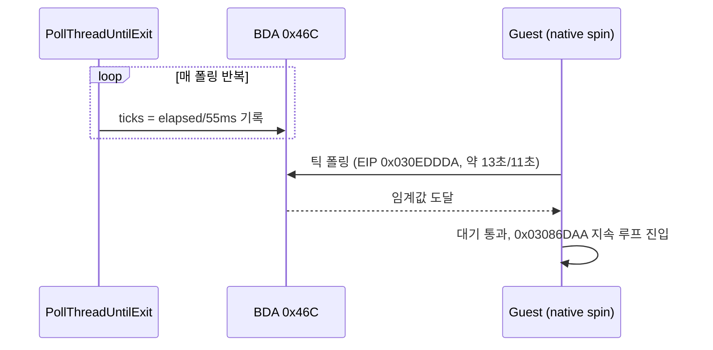

# 20260714-201-system-timer-tick-hle-log

## 작업 개요 (Task Summary)
* **작업 대상:** BDA `0x46C` 시스템 타이머 틱의 동기식 HLE (비동기 타이머 스레드 제거)
* **목적:** 비동기 스레드가 write-watch guard page와 레이스를 일으켜 발생하던 `STATUS_GUARD_PAGE_VIOLATION` 크래시를 제거하고, 게스트의 18.2Hz 틱 폴링 대기 루프가 정상적으로 진행되도록 함
* **관련 문서:** `docs/design/20260714-system-timer-tick-hle.md`, `docs/work-orders/20260714-201-system-timer-tick-hle.md`

---

## 작업 내용 (Detailed Changes)

### 1) 비동기 타이머 스레드 완전 제거
* `src/platform/win32/execution_trampoline.cpp`의 `ThreadContext`에서 `timer_thread`, `timer_thread_shutdown`, `timer_tick_count` 멤버와 `TimerUpdateWorkerProc`, 스레드 생성/소멸 라이프사이클 코드를 모두 롤백하였습니다. 소스 전체에서 해당 심볼이 더 이상 검색되지 않음을 확인하였습니다.

### 2) PollThreadUntilExit 동기식 틱 갱신
* 호스트 폴러 루프의 매 반복마다 `GetTickCount() - start_tick` 경과 시간을 55ms 단위로 나눈 틱 카운트를 `WriteDosLowMemory(&progress_context->dos_low_memory, 0x046C, ticks, 4)`로 기록하도록 구현하였습니다. 단일 스레드 경로이므로 guard page 레이스 가능성이 없습니다.

---

## 검증 결과 (Verification Results)
* **빌드 검증:** `scripts/build_win32_x86.ps1`로 win32_x86_debug 전체 빌드를 재실행하여 컴파일·링크 오류가 없음을 확인하였습니다.
* **런타임 검증:** `REPIU_EXECUTION_TIMEOUT_MS=0`, `REPIU_EXECUTION_BACKEND=aot-dynamic` 환경에서 `repiu_supervisor_win32.exe pumpit1 40000`으로 40초 구동하였습니다.
  * `STATUS_GUARD_PAGE_VIOLATION`(0x80000001)이 전 구간에서 관측되지 않았습니다.
  * 게스트가 EIP `0x030EDDDA`의 대기 루프를 약 13초(6→19초 구간)와 약 11초(20→31초 구간) 동안 네이티브로 돌다가 스스로 통과하였습니다. 틱 카운트가 갱신되지 않던 이전에는 이 지점에서 무한 대기했으므로, 동기식 틱 주입이 실제로 대기 조건을 해소함을 보여 줍니다.
  * 이후 32초부터 supervisor 마감(40초)까지 EIP `0x03086DAA`에서 초당 약 1,140회 디스패치의 지속 실행 루프에 안착하였고, supervisor가 정상적으로 마감 종료(`terminated=true`)하였습니다.

---

## 정정 (2026-07-14, 같은 날 후속 분석)
* 위 런타임 검증 중 "EIP `0x030EDDDA` 대기 루프를 동기식 틱 주입이 해소했다"는 해석은 **철회합니다**. 해당 정지 구간은 디스패치 카운트가 완전히 정지한 상태였는데, 저메모리 `0x46C`는 게스트 주소 공간에 매핑되어 있지 않아 읽기마다 예외 디스패치를 유발하므로 무디스패치 구간은 틱 폴링일 수 없습니다. 후속 정적 분석 결과 이 구간은 자산 초기화 사이클의 네이티브 연산 단계였습니다. 자세한 근거는 `docs/analysis/current-execution-frontier.md`의 2026-07-14 항목을 참조하십시오.
* 크래시(GUARD_PAGE) 소멸과 40초 완주는 그대로 유효합니다. 게임이 `0x46C` 틱을 실제로 소비하는지는 미확정입니다.

## Correction (2026-07-14, same-day follow-up)
* The interpretation that the synchronous tick injection resolved the wait at EIP `0x030EDDDA` is **withdrawn**. Those stall segments had completely frozen dispatch counts, and since low memory `0x46C` is not mapped into the guest address space, every read must raise a dispatch — a zero-dispatch phase therefore cannot be tick polling. Follow-up static analysis identified these phases as native compute stages of an asset-initialization cycle; see the 2026-07-14 entry in `docs/analysis/current-execution-frontier.md`.
* The guard-page crash removal and the full 40-second run remain valid. Whether the game actually consumes the `0x46C` tick is unresolved.

## Task Summary
* **Task:** Synchronous HLE for the BDA `0x46C` system timer tick (asynchronous timer thread removal)
* **Goal:** Eliminate the `STATUS_GUARD_PAGE_VIOLATION` crash caused by the async thread racing write-watch guard pages, and let the guest's 18.2Hz tick-polling wait loops make progress.
* **Result:** Fully removed `timer_thread` / `timer_thread_shutdown` / `timer_tick_count` and `TimerUpdateWorkerProc`; the poller loop now writes `elapsed / 55ms` ticks to `0x46C` via `WriteDosLowMemory` each iteration.

## Verification
* Full win32_x86_debug rebuild passed without errors.
* A 40-second supervised run (`repiu_supervisor_win32.exe pumpit1 40000`, `aot-dynamic`, guest timeout disabled) showed no guard-page exception. The guest natively spun at EIP `0x030EDDDA` for ~13s and ~11s and then advanced on its own — a wait that previously never terminated — before settling into a sustained dispatch loop at `0x03086DAA` (~1,140 dispatches/s) until the supervisor deadline.
