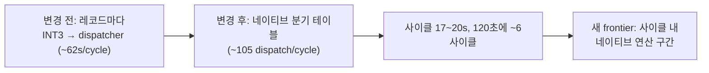

# 20260714-203-aot-jump-table-translation-log

## 작업 개요 (Task Summary)
* **작업 대상:** Watcom switch 점프 테이블(`cmp reg,imm; ja; jmp dword ptr cs:[reg*4+disp32]`)의 AOT 네이티브 번역
* **목적:** 자산 디코드 루프가 레코드마다 dispatcher를 왕복하던 병목(사이클당 약 65,500회, 약 62초) 제거
* **관련 문서:** `docs/design/20260714-aot-jump-table-translation.md`, `docs/work-orders/20260714-203-aot-jump-table-translation.md`
* **결과:** 디코드 루프 디스패치가 사이클당 약 105회로 감소(약 620분의 1)하고 자산 처리 사이클이 약 75~80초에서 약 17~20초로 단축(약 4배). 120초 관찰에서 이전 1사이클 대비 약 6사이클 완료.

---

## 작업 내용 (Detailed Changes)

### 1) 계획 단계 (`src/runtime/aot_translation_plan.cpp`, 헤더)
* `AotInstructionKind::kJumpTable`과 record 필드(`table_targets`, `table_index_register`), plan 통계(`jump_table_count`, `jump_table_target_count`)를 추가하였습니다.
* `ja`(JNBE) 분기 처리 시 직전 record가 `cmp reg, imm`이면 fallthrough 주소에 guard(index register, 엔트리 수 `imm+1`)를 등록합니다.
* guard된 주소의 명령이 `jmp dword ptr [reg*4+disp32]`(프리픽스는 CS/DS만 허용, base 없음, scale 4)이고 register가 일치하면, relocated image에서 테이블 dword `imm+1`개를 읽어 전부 image 내부임을 검증한 뒤 `kJumpTable`로 분류하고 각 target을 CFG `pending`에 추가합니다.
* 블록 방문 순서에 무관하도록, walk 종료 후 guard가 알려진 `kHleBoundary`/`kIndirectExit` record를 재검사해 승격하는 재분류 스윕을 수렴까지 반복합니다.
* 엔트리 수는 61개로 제한합니다(주소 맵 `emitted_length`가 1바이트이기 때문).

### 2) 방출 단계 (`src/runtime/aot_code_cache.cpp`, 헤더)
* `kJumpTable` record에 대해 `jmp dword ptr [reg*4+disp32]`(7바이트) + INT3 fallback(1바이트) + 엔트리 N개의 네이티브 포인터 테이블(4N바이트)을 방출하고 `AotJumpTableSite`로 오프셋들을 기록합니다. CS override는 flat 보호 모드에서 의미가 없어 제거됩니다.
* 방출 실패 조건에서는 기존 INT3 + `kIndirectExit` fixup으로 후퇴합니다.

### 3) Win32 절대 주소 해석 (`src/platform/win32/aot_code_cache_win32.cpp`)
* `ResolveWin32AotJumpTables`가 정적 배치(`PlaceWin32AotCodeCache`)와 동적 추가(`AppendWin32DynamicAotTranslation`)의 RW 윈도우에서 disp32(테이블 절대 주소)와 각 엔트리(번역 블록 절대 주소)를 기록합니다. image에 없는 target 엔트리는 슬롯의 INT3 fallback을 가리켜 dispatcher가 원본 명령 의미로 처리합니다.

### 4) 통계 노출
* `repiu_aot_probe`에 `jump_tables`, `jump_table_targets`, `cache_jump_table_sites`를, 로더 로그에 `Win32 AOT plan jump tables/targets`를 추가하였습니다.

---

## 검증 결과 (Verification Results)

### 빌드·정적 검증
* win32_x86_debug 전체 빌드가 오류 없이 통과하였습니다.
* `repiu_aot_probe PIU.EXE`: `jump_tables=15`, `jump_table_targets=111`, `cache_jump_table_sites=15`, `cache_valid=true` (방출 바이트열 디코드 검증 통과).

### 런타임 검증 (pumpit1, aot-dynamic, 120초)
| 항목 | 변경 전 (동일 120초) | 변경 후 |
| --- | ---: | ---: |
| 총 디스패치 | 약 124,700 | 52,947 |
| 디코드 루프 디스패치/사이클 | 약 65,500 | 약 105 |
| 자산 처리 사이클 시간 | 약 75~80초 | 약 17~20초 |
| 120초 내 완료 사이클 | 1개 | 약 6개 |
* `STATUS_GUARD_PAGE_VIOLATION`, access violation 등 새 예외 없음. supervisor 마감 정상 종료.
* 이전에 디스패치 집중 지점이던 `0x03086DAA`(11-엔트리)와 `0x030EDDDA`(4-엔트리) 모두 디스패치 소멸 — 두 switch가 네이티브로 실행됨을 의미합니다.

### 회귀 확인
* `dos4gw_hello`(기본 legacy 백엔드): `child_exit=0` 정상 종료, 회귀 없음.
* `dos4gw_hello`를 aot 백엔드로 실행하면 "direct control-flow target is outside the cache"로 정적 이미지 빌드가 실패하나, **stash 비교로 변경 전 HEAD에서도 동일하게 실패함을 확인** — 본 작업과 무관한 기존 한계입니다(별도 과제로 기록).

---

## Task Summary
* **Task:** Native AOT translation of Watcom switch jump tables (`cmp reg,imm; ja; jmp dword ptr cs:[reg*4+disp32]`)
* **Changes:** Added `kJumpTable` classification with cmp/ja guard tracking, table validation, and target enqueueing (plus a visit-order-independent reclassification sweep) in the planner; emitted `jmp [reg*4+native_table]` slots with an INT3 fallback and inline pointer tables in the cache builder; resolved absolute addresses during static placement and dynamic append on Win32; exposed statistics via `repiu_aot_probe` and the loader log. Entry count capped at 61 (one-byte emitted length).
* **Verification:** Full build clean; probe reports 15 jump tables / 111 targets on PIU.EXE with a decode-verified cache. A 120-second supervised run shows decode-loop dispatches down from ~65,500 to ~105 per cycle, cycle time down from ~75–80 s to ~17–20 s (~6 cycles vs 1 in 120 s), with no new exceptions. `dos4gw_hello` is unaffected on the default backend; its static-AOT image failure ("direct control-flow target is outside the cache") reproduces on unmodified HEAD and is a pre-existing limitation recorded separately.
