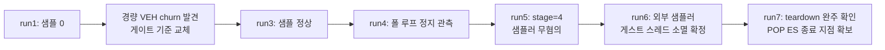

# 20260715-204-native-phase-eip-sampling-log

## 작업 개요 (Task Summary)
* **작업 대상:** 네이티브 무디스패치 구간의 게스트 스레드 EIP 샘플링 텔레메트리 (Task 204)
* **목적:** 600초 관측(2026-07-14)에서 미확정으로 남은 150초 이후 상태(폴링 대기 / 번역 결함 무한 루프 / 장시간 연산)의 판정
* **관련 문서:** `docs/design/20260715-native-phase-eip-sampling.md`, `docs/work-orders/20260715-204-native-phase-eip-sampling.md`, `docs/analysis/current-execution-frontier.md` (2026-07-15 항목)
* **결과:** 세 후보 전부 기각. 침묵 상태의 정체는 **guest `0x030F5074`의 `POP ES` 세그먼트 복원 에필로그에서 발생한 미처리 0xC0000005로 인한 게스트 스레드 종료(exit code 2)** 이며, 그 후 로더 main 스레드가 후속 정리 단계에서 INFINITE 대기에 걸려 프로세스가 종료되지 않는 별도 결함도 발견했다. 사이클 내부 "네이티브 구간"은 실제로는 초당 약 4,500~5,100회의 경량 VEH AOT 처리(inline-cache churn)임을 정량 확인했다.

---

## 작업 내용 (Detailed Changes)

### 1) 공유 텔레메트리 확장 (`include/repiu/platform/win32/live_telemetry.h`, version 8→9)
* 최신 샘플 레지스터/EIP/게스트 EIP, 최근 8개 게스트 주소 링(`native_sample_ring` + mapped 비트/커서), 캡처 단계 마커(`native_sample_stage`), 간접 전이 귀속(`native_sample_indirect_source/target`).
* 게스트 스레드가 직접 미러링하는 `aot_boundary_count`/`aot_reentry_count` (폴 루프 정지와 무관하게 관측 가능).
* supervisor 외부 샘플링용 `guest_thread_id`/`host_main_thread_id`/`aot_cache_base`/`aot_cache_size`.

### 2) 샘플러 신설 (`src/platform/win32/native_phase_sampler.{h,cpp}`)
* suspend → `GetThreadContext(CONTEXT_CONTROL|CONTEXT_INTEGER)` → (EIP가 cache 범위 안일 때만 `FindAotGuestAddress` 역매핑) → resume. suspend~resume 사이 heap/lock/I/O 없음.
* 역매핑 안전 근거: placement는 번역 워커만 변경하며 워커는 게스트 스레드가 블록된 동안에만 동작하므로, 샘플된 EIP가 cache 안이면 워커는 idle이다.
* 실패 시 `failure_stage`/`windows_error` 기록, `[repiu-sample]` stderr 라인 출력.

### 3) 폴 루프 orchestration (`src/platform/win32/execution_trampoline.cpp`)
* **게이트 기준 변경(구현 중 확정):** 원안의 composite progressed 추적은 경량 VEH AOT 경로(`HandleAotReentry`/`HandleAotIndirectTransfer` 등이 dispatch 카운터 없이 `aot_boundary/reentry`를 증가)가 상시 리셋시켜 사용 불가 → `exception_dispatch_entry/exit` 합계 1,000ms 무변화 + 500ms 주기로 교체.
* `BumpAotBoundaryCount`/`BumpAotReentryCount` 헬퍼로 경량 경로 카운터를 공유 텔레메트리에 미러링.
* `REPIU_NATIVE_SAMPLING=0` kill switch, `[repiu-live]` 라인에 `aot=` 카운터 추가, teardown 마일스톤(`host_phase` 10~14) 게시, 게스트 스레드 ID·cache 범위 게시.

### 4) supervisor 외부 샘플러 (`src/host/win32/supervisor_main.cpp`)
* 디스패치·샘플 카운터가 3초 이상 정지하면 2초 주기로 `OpenThread`+`SuspendThread`+`GetThreadContext`로 자식 게스트/메인 스레드를 크로스 프로세스 캡처(`[repiu-supervisor-sample]`). 자식 프로세스와 lock을 공유하지 않아 로더 폴 루프 정지에 면역.
* 스냅샷에 신규 텔레메트리 필드(`aot_boundary/reentry`, `sample_*`, `sample_ring`, `sample_stage`) 출력.

### 5) 빌드 등록 (`CMakeLists.txt`)
* `src/platform/win32/native_phase_sampler.cpp` 추가.

---

## 검증 결과 (Verification Results)

빌드: `scripts/build_win32_x86.ps1` win32_x86_debug 전체 빌드 통과. 구동: `REPIU_EXECUTION_BACKEND=aot-dynamic`, `repiu_supervisor_win32.exe pumpit1 60000~300000` 반복.

| 구동 | 목적 | 결과 |
| --- | --- | --- |
| 240s (초기 게이트) | 첫 검증 | 샘플 0 — progressed 게이트가 경량 VEH churn으로 상시 리셋됨을 발견 |
| 60s (계측 추가) | 게이트 원인 격리 | `aot=` 카운터가 디스패치 정지 구간에도 초당 ~5,000 증가 확인 |
| 60s (dispatch 게이트) | 게이트 수정 검증 | 샘플 102개; EIP가 로더 VEH(`0x101679xx`)·ntdll에 집중 → churn 정량화 |
| 300s | 본 관측 | 157초까지 샘플 288개; 이후 폴 루프 정지 관측 → 원인 분리 필요 |
| 300s (stage·미러) | 정지 지점 분리 | `sample_stage=4`(샘플러 무혐의), `aot` 미러 정지 → 게스트 활동 완전 소멸 확인 |
| 300s (외부 샘플러) | 침묵 상태 판정 | 게스트 스레드 `OpenThread` 실패 87 = **스레드 소멸**; 로더 main은 ntdll `0x774CA07C` INFINITE 대기 |
| 200s (teardown 마커) | hang 지점 판정 | teardown phase 10~14 완주 후 결과 로그까지 출력하고 후속 단계에서 hang; 로더 로그가 종료 지점 바이트 창(`0x030F5074` = `POP ES`)과 `thread exit code 2`를 확보 |
| dos4gw_hello 30s | 회귀 확인 | `child_exit=0 terminated=false` 정상 종료, phase 14 후 정상 exit |

### 판정 (매 구동 로그는 세션 scratchpad `supervisor_204_run1~7.log`)
1. 사이클 내부 "무디스패치 네이티브 구간" = 경량 VEH inline-cache churn (~4,500~5,100 events/s). 마지막 간접 전이 예: `0x030DAEC3→0x03085E9C`, `0x030842E0→0x0305686C`.
2. 150초 이후 침묵 상태 = 게스트 스레드 종료. 종료 예외는 cache `0x06BF4334`(guest `0x030F5074`)의 0xC0000005, 명령은 `pop ebp; pop gs; pop fs; **pop es**; pop edi; ...; ret` 에필로그의 `POP ES`(0x07).
3. 신규 결함: 게스트 종료 후 로더 main이 결과 로그 출력 후 INFINITE 대기로 hang (pumpit1 경로 한정, 후속 과제).

---

## Task Summary
* **Task:** Native-phase guest EIP sampling telemetry (Task 204)
* **Changes:** Extended `Win32SharedLiveTelemetry` to version 9 (latest-sample registers, 8-entry guest-EIP ring, capture-stage marker, indirect-transfer attribution, guest-mirrored `aot_boundary/reentry` counters, thread IDs and cache range); added a dedicated sampler (`native_phase_sampler.{h,cpp}`) that suspends the guest thread, captures control/integer context, reverse-maps cache EIPs, and resumes with no alloc/lock/IO while suspended; orchestrated it from `PollThreadUntilExit` gated on 1,000 ms of dispatch-count silence at a 500 ms cadence (the planned composite-progress gate proved unusable because lightweight VEH AOT paths churn without dispatching); added a cross-process supervisor sampler triggered by 3 s telemetry stalls; published teardown milestones through `host_phase`; added a `REPIU_NATIVE_SAMPLING=0` kill switch.
* **Verification & findings:** Full win32_x86_debug builds passed; seven instrumented pumpit1 runs (60–300 s) plus a clean `dos4gw_hello` regression run. The in-cycle "zero-dispatch native phases" are lightweight VEH inline-cache churn at ~4,500–5,100 events/s. The post-150 s silent state is guest-thread termination (exit code 2) on an unhandled 0xC0000005 at guest `0x030F5074` — the `POP ES` of a segment-restore epilogue — confirmed externally by OpenThread returning `ERROR_INVALID_PARAMETER`; a separate loader hang after the attempt result logging (an INFINITE ntdll wait past teardown phase 14, pumpit1 path only) was discovered and recorded as a follow-up. All three 2026-07-14 candidates for the silent state are withdrawn in `docs/analysis/current-execution-frontier.md`.
