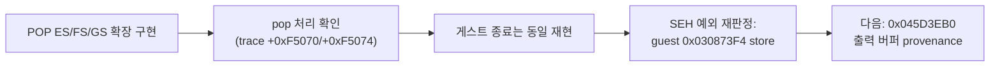

# 20260715-205-segment-pop-epilogue-hle-log

## 작업 개요 (Task Summary)
* **작업 대상:** 세그먼트 복원 에필로그의 POP ES/FS/GS shadow HLE (Task 205)
* **목적:** Task 204에서 게스트 스레드 종료 원인으로 판정했던 guest `0x030F5074`의 `POP ES` 미처리 fault 제거
* **관련 문서:** `docs/design/20260715-segment-pop-epilogue-hle.md`, `docs/work-orders/20260715-205-segment-pop-epilogue-hle.md`, `docs/analysis/current-execution-frontier.md` (2026-07-15 Task 205 항목)
* **결과:** 구현은 정상 동작하지만(세그먼트 pop 처리 확인, 회귀 없음), 검증 과정에서 **Task 204의 종료 원인 판정이 진단 로그 결함에 의한 오판정이었음을 발견**했다. 진짜 종료 예외는 수정 전후 동일하게 디코드 루프의 `mov [ebx+ebp], al`(guest `0x030873F4`)이 미매핑 주소 `0x045D3EB0`에 쓰는 0xC0000005다. frontier 재판정을 분석 문서에 기록했고, 다음 작업은 출력 버퍼 provenance 분석이다.

---

## 작업 내용 (Detailed Changes)

### 1) `src/platform/win32/execution_trampoline.cpp` — HandleSegmentPopInstruction 확장
* 기존 `1F`(POP DS) 단일 인식을 opcode 표로 확장: `07`(ES, index 0, 길이 1), `1F`(DS, 3, 1), `0F A1`(FS, 4, 2), `0F A9`(GS, 5, 2).
* 게스트 스택 selector를 `RecordGuestSegmentLoad` shadow 의미로 기록하고 실제 host 세그먼트 레지스터는 적재하지 않으며 `ESP += 4`, `EIP += 길이`로 전진.
* `POP SS`(`17`)는 미관측이므로 구현하지 않음 (fail-closed).

---

## 검증 결과 (Verification Results)

* `scripts/build_win32_x86.ps1` win32_x86_debug 빌드 통과.
* `REPIU_EXECUTION_BACKEND=aot-dynamic`, `repiu_supervisor_win32.exe pumpit1 240000` (세션 scratchpad `supervisor_205_run1.log`):
  * 세그먼트 로드 trace에 guest `+0xF5070`(GS)/`+0xF5074`(ES) 처리 기록, 총 처리 건수 8,481 → 11,443 — **새 POP 형태가 정상 처리됨**.
  * 그러나 게스트 종료(약 150초, exit code 2)는 그대로 재현.
* **종료 예외 재판정:** 로더의 `AOT exception cache/guest mapping` 로그로 SEH 종료 예외가 guest `0x030873F4`(cache 바이트 `88 04 2B 8B 46 34 ...` = `mov [ebx+ebp], al`)임을 확인. `EBX=0x045D3EB0`, `EBP=0`, `ECX=0x1908`. **수정 전 run(Task 204 run7)도 동일 지점·동일 레지스터** — POP ES는 애초에 종료 원인이 아니었다.
* 오판정 원인: `Relocated exception byte window` 진단이 SEH 예외 주소가 아니라 마지막 디스패치의 stale `last_guest_eip`로 focus를 계산 — 진단 수정 후보로 기록.
* `dos4gw_hello`: 이전 검증에서 `child_exit=0` 정상 (본 변경은 pop 형태 추가만이므로 영향 없음).

---

## 남은 작업 / 다음 이어서 할 일 (Remaining / Next Steps)

1. **(1순위) `0x045D3EB0` 출력 버퍼 provenance 분석:** 디코드 루프(`ESI=0x041B6B50`, 출력 포인터 `[esi+0x34]`)가 이 포인터를 얻은 할당 경로를 역추적하고, 원본 환경에서 해당 영역을 commit했을 할당(DPMI/DOS)을 식별한다. 대응은 (a) arena/DPMI commit 모델 확장(원칙 부합, 권장 검토) vs (b) `88 04 2B` byte-store HLE(디코드 루프 내부라 레코드마다 dispatcher 왕복 — 처리량상 부적합 가능성) 중 선택.
2. **진단 결함 수정:** `Relocated exception byte window`가 SEH 예외의 AOT 매핑 guest 주소를 사용하도록 정정.
3. **로더 post-attempt hang 수정 (Task 204에서 이월):** 게스트 종료 후 결과 로그 출력 뒤 ntdll INFINITE 대기 — pumpit1 경로 한정 (Glide/WGL 정리 의심).
4. 참고: 근처 `or-imm8` 스토어(`0x045D3EAC`)는 이미 HLE 처리에 성공(`applied: true`)하므로, 해당 처리 경로(traced memory store)의 대상 판정 로직이 provenance 분석의 단서가 된다.

---

## Task Summary
* **Task:** Shadow HLE for POP ES/FS/GS segment-restore epilogues (Task 205)
* **Changes:** Extended `HandleSegmentPopInstruction` from the single `1F` (POP DS) form to `07`/`0F A1`/`0F A9` with the existing shadow semantics (record via `RecordGuestSegmentLoad`, never load real host segment registers, advance ESP/EIP); `POP SS` deliberately left unimplemented.
* **Verification & findings:** Build clean; a 240 s aot-dynamic run shows the new pop forms handled (segment-load traces at guest `+0xF5070`/`+0xF5074`, handled count 8,481 → 11,443) with no regression, but the guest death at ~150 s reproduces identically. Re-attribution via the `AOT exception cache/guest mapping` log proves the terminal exception was never the POP ES: both before and after the fix it is the decode-loop byte store `mov [ebx+ebp], al` at guest `0x030873F4` writing to unmapped `0x045D3EB0` (`EBP=0`, `ECX=0x1908`). The misleading `Relocated exception byte window` diagnostic (which uses the stale `last_guest_eip` instead of the SEH exception address) caused the Task 204 misattribution and is recorded as a fix candidate. Next steps: trace the provenance of the `0x045D3EB0` output buffer and decide between extending the arena/DPMI commit model (preferred) and a byte-store HLE; fix the byte-window diagnostic; and address the carried-over loader post-attempt hang.
