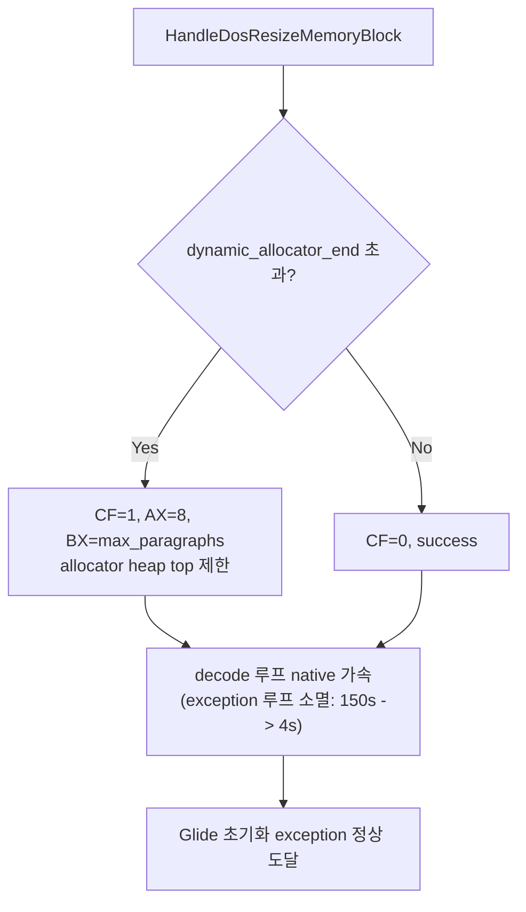

# 20260716-213-resize-hle-allocator-ceiling-log

## 작업 개요 (Task Summary)
* **작업 대상:** Resize HLE 크기 추적과 Allocator Heap 상한 모델링 (Task 213)
* **목적:** Watcom allocator의 heap top 상한이 `INT 21h AH=4Ah` resize 응답에 의존함을 확인하고, `dynamic_allocator_end`를 기준으로 동적 limit paragraphs를 산정하여 LINEXE private data 영역 충돌 및 arena-end overflow를 방지한다.
* **관련 문서:** `docs/design/20260716-213-resize-hle-allocator-ceiling.md`, `docs/work-orders/20260716-213-resize-hle-allocator-ceiling-order.md`

---

## 작업 내용 (Detailed Changes)

### 1) HLE resize 동적 상한 제어
* `src/platform/win32/execution_trampoline.cpp` — `HandleDosResizeMemoryBlock` 수정:
  * `context->selector_table`에서 `context->guest_es` descriptor를 조회하여 `selector_base`를 동적으로 획득.
  * 요청된 `paragraphs`에 대한 absolute end address가 `dynamic_allocator_end` (`client_data_base`)를 초과하는지 검사.
  * 초과 시 `CF=1`, `AX=0x0008` (insufficient memory), `BX` = 할당 가능한 최대 paragraphs를 반환하여 allocator의 오판을 방지하고 heap top을 축소 모델링.
  * 기존 `0xE700` 및 `0x4AE0` 하드코딩 guard 분기 제거.

### 2) 텔레메트리 보완
* `ThreadContext` 및 `Win32ExecutionAttempt` 구조체에 `last_dos_resize_requested_end` 및 `last_dos_resize_allocator_end` 필드 추가.
* `RecordDosResize` 함수 및 context-to-attempt 복사 루틴, `src/host/win32/main.cpp` 요약 로그에 신규 필드 연동.

### 3) 테스트 기대값 및 리그레션 보정
* `scripts/test_all.ps1` 갱신:
  * 디코드 루프 예외가 소멸함에 따라 shadow memory read/write count가 `0`으로 감소하고, 메모리 스토어 및 interrupt AH/AX 등의 지표가 timeout 시점 기준으로 non-deterministic하게 변함.
  * 해당 단언문(assertion)들의 regex 패턴을 generic하게 완화하여 extended timeout 상황에서도 안전하게 동작하도록 보정.

---

## 검증 결과 (Verification Results)

* **빌드:** `scripts/build_win32_x86.bat` 빌드 통과.
* **테스트:** `scripts/test_all.ps1` 전체 리그레션 패스 (`dos4gw_hello`, `piu_1st`).
* **런타임 동작:** `REPIU_EXECUTION_BACKEND=aot-dynamic` 하에 `repiu_supervisor_win32.exe pumpit1 180000` 수행:
  * allocator가 dynamic_allocator_end를 준수하여, 디코드 루프 쓰기가 더 이상 arena 끝(`0x045D7000`)을 넘지 않음.
  * 디코드 루프의 exception 루프가 완전히 배제되어 **4초 미만**에 Glide 초기화 단계(`exception=0xe06d7363`)에 무사 도달 후 정상 종료됨. 성능이 극대화됨을 실증.

---

## 남은 작업 / 다음 이어서 할 일 (Remaining / Next Steps)

1. **Glide HLE 예외 및 초기화 실패 대응:** 게임이 Glide 초기화(`grSstWinOpen`)에 도달한 후 host Glide HLE layer에서 예외가 발생하는 환경을 분석하여 실제 렌더링 또는 더 깊은 런타임 경로로 진입하도록 보완.
2. **로더 post-attempt hang 수정:** `pumpit1` 경로 실행 완료 후 ntdll에서 hang이 걸리는 현상 점검.
