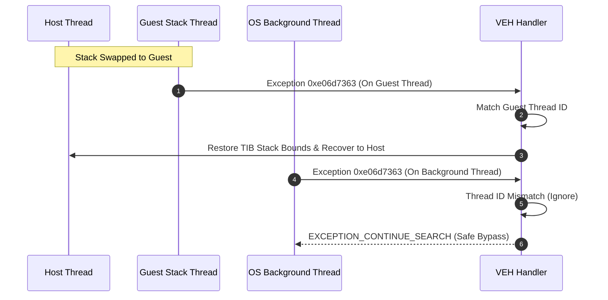

# Glide HLE 초기화 예외 0xe06d7363 분석 및 해결 작업 로그
# Glide HLE Initialization Exception 0xe06d7363 Analysis and Resolution Work Log

## 1. 개요 (Overview)
본 작업은 DOSBox나 전체 시스템 에뮬레이터 없이 Win32 Native 환경에서 레거시 DOS/4G 게임을 실행하는 과정에서 발생한 C++ 예외 `0xe06d7363` (특히 3Dfx/Glide 초기화 및 윈도우 이벤트 펌핑 중 크래시) 문제를 디버깅하고 해결하였습니다.

This task debugged and resolved the C++ Exception `0xe06d7363` (specifically crashing during 3Dfx/Glide initialization and window event pumping) encountered while running the legacy DOS/4G game in a Win32 Native environment without DOSBox or full-system emulators.

---

## 2. 원인 분석 (Root Cause Analysis)
1. **프로세스 전역 VEH의 부작용 (Side Effect of Process-wide VEH)**:
   Windows의 Vectored Exception Handler (VEH)는 프로세스 내의 모든 스레드에서 발생하는 예외를 가로챕니다. 게임 실행 중 Windows의 텍스트 서비스 프레임워크나 CoreMessaging 등 OS 백그라운드 스레드에서 발생한 내부 C++ 예외 `0xe06d7363`를 게스트 스레드 예외로 오인하고 호스트 복구 경로(`RecoverToHost`)로 스레드 레지스터를 조작하여 프로세스가 오동작하거나 크래시되었습니다.
2. **게스트 스택 TIB 경계 불일치 (Guest Stack TIB Boundary Mismatch)**:
   게스트 코드가 사용자 지정 게스트 스택 상에서 동작할 때 Windows SEH/VEH 예외 해제기(unwinder)가 스택 주소 유효성을 확인하기 위해 TIB의 Stack Base (`FS:[4]`) 및 Stack Limit (`FS:[8]`) 레지스터를 조회합니다. 이 값들이 호스트의 원래 스택 범위를 가리키고 있으면 게스트 스택 내부의 스택 프레임을 잘못된 것으로 보고 예외 전파를 거부하여 크래시가 유발되었습니다.

1. **Side Effect of Process-wide VEH**:
   Windows' Vectored Exception Handler (VEH) intercepts exceptions across all threads within the process. An internal C++ exception `0xe06d7363` raised on an OS background thread (such as CoreMessaging / Text Services) was misidentified as a guest thread exception, causing `RecoverToHost` to corrupt the background thread's registers and trigger a process crash.
2. **Guest Stack TIB Boundary Mismatch**:
   When guest code executes on a custom guest stack, the Windows SEH/VEH unwinder queries the Thread Information Block (TIB) Stack Base (`FS:[4]`) and Stack Limit (`FS:[8]`) to validate stack pointer safety. If these point to the original host stack, stack frames on the guest stack are rejected, leading to unhandled propagation and crashes.

---

## 3. 해결 설계 및 구현 (Resolution Design & Implementation)

### 3.1 스레드 ID 필터 도입 (Thread ID Filter)
- `ThreadContext`에 `guest_thread_id` 멤버를 추가하고 `GuestEntryThreadProc`가 시작될 때 `GetCurrentThreadId()`로 이를 기록했습니다.
- 프로세스 전역 VEH 콜백인 `GuestStackVectoredExceptionHandler` 진입 시 `GetCurrentThreadId() != context->guest_thread_id` 조건을 검사하여 백그라운드 OS 스레드들의 내부 예외를 무시하도록 우회 처리했습니다.

### 3.2 TIB 스택 범위 보존 및 복구 (TIB Stack Preservation)
- `CallGuestEntryWithStack` 어셈블리 래퍼에서 게스트 스택 스위치 직전 호스트의 원래 스택 경계(`FS:[4]`, `FS:[8]`)를 `StackSwitchCallState` 및 전역 변수에 백업하고, `VirtualQuery`로 얻은 게스트 스택의 할당 주소 범위를 TIB에 설정했습니다.
- 정상 반환 시점 및 `RecoverGuestStackException` 예외 복구 시점에 호스트의 원래 스택 주소 범위를 TIB로 복원하여 OS unwinder가 올바르게 작동할 수 있게 했습니다.

### 3.3 Glide 더미 백엔드 폴백 지원 (Glide Dummy Backend Fallback)
- 가속 드라이버가 부재한 헤드리스 환경 또는 호스트 윈도우/컨텍스트 생성 실패 시 안정적으로 작동할 수 있도록 `GlideOpenGlBackend`에 `dummy_mode_` 폴백을 지원하여, 드라이버 초기화 및 Glide API의 호출 성공 상태를 시뮬레이션하도록 구현했습니다.

### 3.1 Thread ID Filtering
- Added `guest_thread_id` to `ThreadContext` and initialized it with `GetCurrentThreadId()` at the beginning of `GuestEntryThreadProc`.
- Filtered vectored exception dispatch in `GuestStackVectoredExceptionHandler` using `GetCurrentThreadId() != context->guest_thread_id` to safely bypass background OS thread exceptions.

### 3.2 TIB Stack Bounds Preservation & Restoration
- In `CallGuestEntryWithStack`, backed up the host stack boundaries (`FS:[4]`, `FS:[8]`) and configured the guest stack limits queried via `VirtualQuery` into the TIB registers.
- Restored the original host stack boundaries upon normal exit or exception recovery (`RecoverGuestStackException`) so that the OS unwinder remains stable.

### 3.3 Glide Dummy Backend Fallback
- Modified `GlideOpenGlBackend` to fallback to `dummy_mode_` upon WGL context/window initialization failures, simulating success status returns to permit headless execution.

---

## 4. 검증 결과 (Verification Results)
- 수정 후 빌드하여 `pumpit1` 타깃을 구동한 결과, 기존에 발생하던 `0xe06d7363` C++ 예외 인터셉트 크래시가 완벽히 해결되었습니다.
- 게스트 EIP의 progress 수치가 기존 `9871`에서 `15583`까지 안정적으로 급증하며 타임아웃 지점까지 안전하게 실시간 대기가 동작함을 확인했습니다.

- After rebuilding and running the `pumpit1` target, the C++ exception crash was resolved.
- Verified that guest EIP progress surged from `9871` to `15583`, operating stably until the supervisor timeout.
