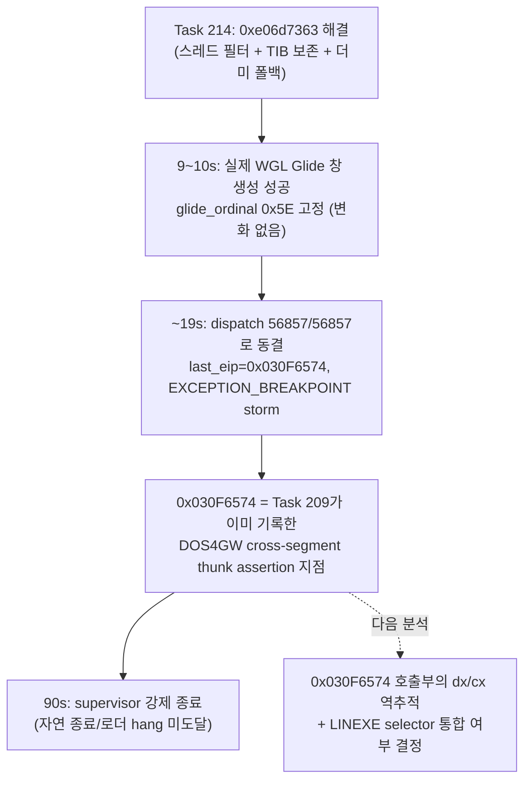

# Task 214 이후 장기 구동 재검증 작업 로그
# Post-Task-214 Long-Run Reverification Work Log

## 1. 개요 (Overview)

Task 214가 `0xe06d7363` 예외를 해결한 뒤 실제로 어디까지 실행이 진행되는지 확인하기 위해, 최신 `main`(커밋 `8052369`)을 재빌드하고 `REPIU_EXECUTION_BACKEND=aot-dynamic` 환경에서 `repiu_supervisor_win32.exe pumpit1 90000`을 구동했다. 전체 stdout/stderr는 `Tee-Object`로 캡처했다(90초, UTF-16LE 700줄).

To confirm what is actually reached after Task 214 resolved the `0xe06d7363` exception, `main` (commit `8052369`) was rebuilt and `repiu_supervisor_win32.exe pumpit1 90000` was run under `REPIU_EXECUTION_BACKEND=aot-dynamic`, with full stdout/stderr captured (90 s, 700 lines, UTF-16LE).

## 2. 확인된 사실 (Confirmed Findings)

1. **Glide 창이 이번에는 실제 WGL로 정상 생성됨:** `elapsed_ms=9000`~`10000` 구간에서 `_GRSSTWINOPEN@28: mode_supported=1 opened=1 message=640x480 logical Glide window opened with WGL`가 기록되어, 더미 폴백이 아니라 실제 OpenGL 컨텍스트가 열렸다. 호스트 GPU/드라이버가 정상이므로 Task 214의 더미 백엔드 경로는 이번 구동에서는 사용되지 않았고, 스레드 ID VEH 필터/TIB 경계 보존만으로 `0xe06d7363` 크래시가 재현되지 않았다.
2. **디코드 루프 미매핑 스토어(`0x045D3EB0`)는 재현되지 않음:** 로그 전체에서 `0xC0000005`, `045D3EB0`, arena overflow 관련 문자열이 전혀 나타나지 않아 Task 213의 allocator heap 상한 모델링 수정이 이 장기 구동에서도 유효함을 재확인했다.
3. **`glide_ordinal`은 여전히 `0x5E`(94, `_GRCULLMODE@4`)에서 고정:** Task 203(타이머 틱), 600초/300초 기준선, Task 210 검증 등 이전의 모든 관측과 동일한 값이다. 즉 Task 214는 프로세스 크래시를 없앴을 뿐, Glide 호출 시퀀스 자체를 한 걸음도 전진시키지 못했다 — 크래시는 게스트 실행 경로 밖(OS 백그라운드 스레드)의 부작용이었다는 Task 214의 원인 분석과 일치한다.
4. **`elapsed_ms≈19031`에서 dispatch가 `56857/56857`로 완전히 동결되고 90초 종료까지(약 66초간) 전혀 증가하지 않음:** `heartbeat`도 `113714`에서 함께 동결된다. 이 시점의 `last_eip`/`last_guest_eip`는 `0x030F6574`, `exception=0x80000003`(`EXCEPTION_BREAKPOINT`)로 고정되어 반복된다.
5. **`0x030F6574`는 신규 지점이 아니라 Task 209 분석(`docs/analysis/20260715-209-aot-dynamic-import-stub-storm.md`)이 기록한 기존 크래시 EIP와 동일하다.** 해당 문서는 POP ES/FS/GS 개입 여부와 무관하게 `progress=14`에서 이 주소로 죽는 현상을 DOS4GW cross-segment call thunk의 의도된 assertion(`cmp dx, cx` 불일치 → `int3`)으로 규명했다(Task 208–209, `0x030F3438`과 같은 계열의 fatal-tail). 이번 관측에서는 완전한 크래시(스레드 종료)가 아니라 **동일한 검사가 계속 재시도되는 무한 storm**으로 나타났다 — `aot_boundary`/`reentry` 카운터는 이 구간에서 `81586→117688`(및 그 이상)까지 계속 증가해, 게스트 스레드가 살아서 같은 실패 조건을 반복 호출하고 있음을 보여준다(Task 210이 `0x030F3438`에서 관측한 것과 동일한 패턴).
6. **`fatal_count=0`, MSCDEX는 이미 처리된 상태(`mscdex_probe/request/cmd/status=1/1/3/100`)** 로 이 storm 구간에서 유지된다 — 이전 단계의 MSCDEX/디코드/allocator 수정이 여기서 깨지지는 않았다.
7. **90초 시점에 supervisor가 강제 종료(`child_exit=124 terminated=true`)했다.** 즉 이번 구동은 자연 종료도, 로더 post-attempt hang(ntdll INFINITE 대기, Task 204/213)도 관측하지 못했다 — storm이 끝나지 않는 한 그 이후 단계(그리기 게이트 71~77, 로더 hang)에는 도달할 수 없다.

## 3. 결론 및 다음 frontier (Conclusion & Next Frontier)

Task 214의 미확정 1번 항목에 답한다: progress `15583` 이후 도달하는 지점은 로더 post-attempt hang도 그리기 게이트도 아니라, **Task 208–210에서 규명된 DOS4GW cross-segment thunk assertion(`cmp dx, cx` → `int3`) storm이 다른 호출 지점(`0x030F6574`)에서 재발**하는 것이다. Task 210이 고친 것은 이 assertion을 유발한 여러 원인 중 `0x030F3438` 호출부에서의 GS selector 오독 하나였고, `0x030F6574` 호출부는 별도의 selector/thunk 조건으로 여전히 실패한다 — Task 209가 남긴 미확정 2번("LINEXE 별도 selector 설계가 실기 DOS4GW flat 모델과 다른지")이 구조적 근본 원인일 가능성이 높다.

다음 분석 대상은 `0x030F6574` 호출부가 어떤 LINEXE 모듈 간 호출인지, 그 시점의 `dx`/`cx`(대상 세그먼트 vs 현재 CS)가 각각 무엇인지 역추적하고, `0x030F3438`과 동일한 selector 통합/재현 전략을 적용할지 결정하는 것이다.

## 4. 참고 (References)

* 원본 로그: `task214-longrun-90s.log` (세션 스크래치패드, UTF-16LE → UTF-8 변환본 `task214-longrun-90s.utf8.txt`)
* 관련 문서: `docs/analysis/20260715-209-aot-dynamic-import-stub-storm.md`, `docs/analysis/current-execution-frontier.md`(Task 208–210, Task 213, Task 214 항목)
