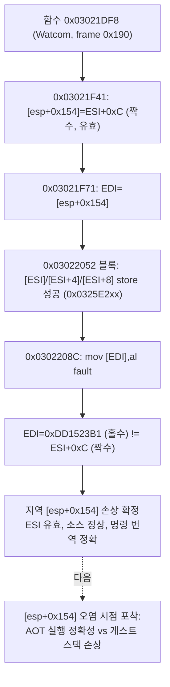

# 문자열 복사 스토어 frontier(0x0302208C) 분석 작업 로그
# Work Log: String-Copy Store Frontier (0x0302208C) Analysis

## 1. 이번 작업 범위 (Scope)

Task 221이 남긴 새 종료 지점 guest `0x0302208C`(`mov [edi], al`)가 wild pointer
`0xDD1523B1`에 쓰다 죽는 현상의 **EDI 출처 확정**과, Task 221에서 미룬 **trap 백엔드
30초 회귀 확인**을 수행했다. 코드 변경은 종료 예외 진단에 **게스트 스택 창 캡처**를
추가한 것뿐이며, 게임 로직/HLE 동작은 바꾸지 않았다.

## 2. 선행 확인: trap 백엔드 30초 회귀 (없음)

`REPIU_EXECUTION_BACKEND` 미설정(기본 trap 단일스텝) + `repiu_supervisor_win32 pumpit1 30000`:
progress **118,692** / single_step 965,785로 30초 데드라인까지 완주(`child_exit=124`는
슈퍼바이저 타임아웃, 크래시 아님), `fatal_count=0`, 28초에 Glide 창까지 열림. Task 220
기준선(118,504) 동등 이상 — **회귀 없음.** (로그: `task222-trap-30s.log`)

주목: 이 30초 trap 구동에서는 `0x0302208C` fault가 **재현되지 않았다.**

## 3. 진단 보강: 종료 예외 스택 창 캡처

`CaptureException`(`execution_trampoline.cpp`)은 이미 fault 시점 `ContextRecord`에서
전체 레지스터(`exception_eax..edi`, snapshot)와 `[ESI+0x20..]` 8 dword를 캡처하고
main.cpp가 이를 보고하고 있었다 — Task 221 분석의 "fault VA만 기록" 서술은 오판이었다.
빠져 있던 것은 **호출 프레임/인자 프레임을 담은 스택 내용**이라, fault 시점 ESP에서
`kWin32ExceptionStackDwordCapacity`(96) dword를 캡처하는 필드
(`exception_stack_base`/`exception_stack_dwords`/`exception_stack_dword_count`)를
`ThreadContext`와 attempt 구조체에 추가하고, main.cpp가 4 dword/행으로 보고하도록 했다.
(자식 stderr 파이프가 라인을 ~119자에서 자르므로 8→4 dword/행으로 조정.)

## 4. 확정된 사실 (Findings)

역어셈블(`repiu_aot_probe`, 기준 주소 = 런타임−0x02000000)과 새 스택 캡처를 결합해
확정했다. 문제 함수 entry는 **guest `0x03021DF8`**(Watcom 레지스터 호출 규약,
`push ebx/ecx/esi/edi/ebp; sub esp, 0x17C` → 프레임 0x190, epilogue `add esp,0x17C; pop×5; ret`).

1. **EDI는 caller 인자가 아니라 지역변수다 (이전 분석 정정).** `0x03021F41`
   `lea eax,[esi+0x0C]; mov [esp+0x154], eax`로 지역 `[esp+0x154] = ESI+0xC`를 만들고,
   `0x03021F71` `mov edi,[esp+0x154]`로 EDI에 싣는다. 함께 `[esp+0x150]=ESI`,
   `[esp+0x148]=ESI+4`, `[esp+0x144]=ESI+8`도 만든다. 오프셋 0x144~0x164는 전부 0x17C
   프레임 **내부 지역변수**다. Task 221/222 초기 기록의 "`[esp+0x140]/[esp+0x13C]`는
   caller 제공 포인터"는 틀렸다 — 모두 ESI에서 파생된 지역이다.
2. **구조체 필드 store는 성공, 파일명 store만 fault.** 블록 `0x03022052`는 전역 테이블의
   16비트 필드 3개를 `[ESI]`/`[ESI+4]`/`[ESI+8]`(fault 시점 `0x0325E208`/`20C`/`210`,
   유효 heap)에 쓴 **뒤** `0x0302208C`에서 `[EDI]=al`(파일명 첫 바이트)에 fault한다.
   앞 세 store가 성공했으므로 **구조체 베이스 ESI는 유효**하다.
3. **EDI(0xDD1523B1)는 홀수 → ESI+0xC일 수 없다.** ESI=`0x0325E208`(짝수)면
   ESI+0xC=`0x0325E214`(짝수)여야 하는데 EDI는 홀수 wild 값이다. 복사 루프는 EDI를 2씩
   증가시키므로 짝수 시작이면 홀수가 될 수 없다. 따라서 **파일명 목적지 포인터를 담은
   지역 `[esp+0x154]`가 `ESI+0xC`가 아닌 손상된 값으로 바뀌어 있었다.**
4. **소스 데이터는 정상.** ESI(fault)=`0x032953AC`(전역 테이블), `[ESI+0x20]` 덤프는
   `0x742E3130 0x00006167` = `"01.tga\0"`로 정상 NUL 종결. AOT 캐시 바이트도 `88 07`
   (`mov [edi],al`)로 **명령 번역 자체는 정확**하다. 즉 미구현 HLE가 채워야 할 소스
   구조체 문제(가설 a)도, 소스 문자열 미종결(가설 b)도 **아니다.**

결론: 이 frontier는 **파일명 목적지 지역 포인터 `[esp+0x154]`가 손상된 것**이며, wild
값이 홀수이고 trap 30초 구동에서 미재현이라는 점에서 소스/HLE 데이터 공급 문제가 아니라
**실행(AOT-dynamic) 경로에서 이 지역 슬롯이 오염되는 문제**일 가능성이 크다.



## 5. 검증 (Verification)

* 빌드: `scripts/build_win32_x86.ps1` (win32_x86_debug Debug) 통과.
* aot-dynamic 60초(`REPIU_EXECUTION_TIMEOUT_MS=0`): 39.4초에 동일 frontier 재현,
  새 스택 창 96 dword가 정상 출력됨(`child_exit=0`, hang 없음). 로그
  `task222-stackcap2.log`. 스택에서 `[esp+0x154]`(=fault_esp+0x158)=`0xDD1523B1`,
  인접 `[esp+0x150]`=`0x0325E208`, `[esp+0x148]`=`0x0325E20C`, `[esp+0x144]`=`0x0325E210`
  확인.
* trap 30초: 회귀 없음(§2).

## 6. 추가 확인 (Follow-up, 같은 세션)

* **AOT 정적 번역 정확 — 정적 원인 배제.** `repiu_aot_probe` 캐시 emit: `0x03021F41
  mov [esp+0x154],eax` → `89 84 24 54 01 00 00`, `0x03021F71 mov edi,[esp+0x154]` →
  `8b bc 24 54 01 00 00`, `0x03021F5C/63 [esp+0x150]` → `89/8b b4 24 50 01 00 00`.
  displacement 오번역이 아니다.
* **역설 확정.** 프레임 매핑 `D=4`로 5개 슬롯이 ESI=`0x0325E208`에 일관되게 맞는데
  `[esp+0x154]` 한 슬롯만 오염. `[esp+0x154]`(0x03021F41)와 `[esp+0x150]`(0x03021F5C)은 같은
  블록·같은 esp에서 연속 기록되고 사이에 call/push/pop/boundary 없음 — 동기·정확 번역 모델로
  설명 불가. `0xDD1523B1`은 fault 이전 HLE 트레이스/레지스터에 미등장.
* **trap 120초:** resize `134/212`로 fault 코드 **미도달**(child_exit=124). trap 미재현은
  경로 미도달이며 "AOT 특이"의 증거는 아직 아니다.

## 7. 런타임 캐시 프로브 (후보 (a) 배제)

`CaptureException`에 env `REPIU_AOT_PROBE_GUEST`로 지정한 게스트 주소를
`FindAotCacheAddress`로 런타임 캐시에 매핑해 32바이트를 덤프하는 진단을 추가했다
(`aot_probe_*` 필드, main.cpp 16바이트/행 보고). `REPIU_AOT_PROBE_GUEST=0x03021F3E`로 구동한
결과 cache `0x0D7901B1`에서:

```
8D 46 0C              lea eax,[esi+0xC]
89 84 24 54 01 00 00  mov [esp+0x154], eax   ; esi+0xC → [esp+0x154] (정확)
8D 46 08              lea eax,[esi+8]
89 84 24 44 01 00 00  mov [esp+0x144], eax
8D 46 04              lea eax,[esi+4]
89 84 24 48 01 00 00  mov [esp+0x148], eax
```

정적 plan과 **바이트 단위 동일**. 런타임 동적 번역이 정적과 다르지 않음이 확정 —
**후보 (a) 배제.** store는 정확히 `esi+0xC`(짝수, 유효)를 쓴다.

## 8. 남은 확인 (Open / 다음 작업)

정적·동적 AOT 번역이 모두 정확하므로, store(`0x03021F41`)와 load(`0x03021F71`) 사이에
게스트 스택 슬롯 `0x035D6B14`(=`[esp+0x154]`)가 **게스트 명령 스트림 외부에서 비동기로
덮어써지는 것**(후보 b)이 남은 유일한 기제다. 다음 진단은 이 게스트 주소에 **하드웨어
워치포인트**(DR0/DR7)를 걸어 쓰기 EIP를 포착하는 것 — AOT의 TF/int3 기구와 공존해야 하므로
별도 설계가 필요한 새 작업 단위다. 근인 확정 전 HLE 추측 수정은 하지 않는다(AGENTS.md).

---

**English summary.** Ran the deferred Task 221 trap-backend 30 s regression (progress 118,692,
no fatal, Glide window opened at 28 s — no regression; the `0x0302208C` fault did **not**
reproduce under trap). The only code change is a diagnostic: the terminal-exception capture
already recorded full fault-time registers and `[ESI+0x20..]` (the Task 221 "only fault VA"
note was mistaken), so this adds a **guest stack-window capture** (96 dwords from fault ESP)
to `CaptureException`, propagated to the attempt struct and reported 4 dwords/row (the child
stderr pipe truncates lines at ~119 chars).

Findings, correcting the earlier read: the faulting function is guest `0x03021DF8` (Watcom
register convention, 0x190-byte frame). EDI is **not** a caller argument — it is local
`[esp+0x154]`, set to `ESI+0xC` at `0x03021F41` and loaded at `0x03021F71`; offsets
0x144–0x164 are all in-frame locals derived from ESI. The three 16-bit field stores to
`[ESI]/[ESI+4]/[ESI+8]` (valid heap `0x0325E2xx`) **succeed** before the filename store faults,
so the struct base ESI is valid. Crucially EDI (`0xDD1523B1`) is **odd**, so it cannot be
`ESI+0xC` (even) — the filename-destination local `[esp+0x154]` was corrupted to a wild odd
value. Source data is fine (`"01.tga\0"` at ESI, correct `88 07` AOT bytes), ruling out both
a missing-HLE source structure and an unterminated source string. This reframes the frontier
as **corruption of the destination-pointer local**, likely on the AOT-dynamic execution path
(not reproduced under the 30 s trap run). Next: catch what overwrites `[esp+0x154]` between
`0x03021F41` and `0x03021F71` via write-watch / trap single-step of block `0x03021F3E`; do not
apply a speculative HLE fix until the corruption source is confirmed.
