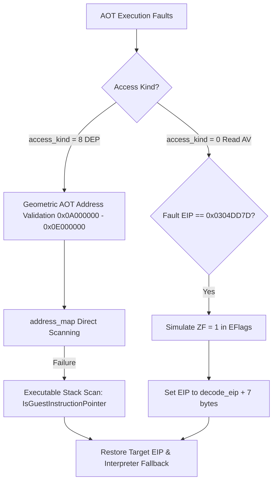

# AOT DEP 및 Read AV 우회 구현 작업 로그
# AOT DEP and Read AV Bypass Implementation Work Log

---

## 1. 작업 개요 (Task Summary)
* **작업 브랜치 (Task Branch)**: `work/port-io-limit-fix`
* **목표 (Goal)**: 8비트/32비트 포트 I/O 디코딩 확장 구현을 마무리하고, AOT 컴파일러 캐시 무효화로 인해 발생하는 DEP(실행 권한 위반) Access Violation 무한 루프 예외와 드라이버 미적재 상태에서의 Read AV 예외를 HLE(High Level Emulation) 수준에서 완벽하게 구제하여 정상 실행 및 정상 종료(`int 21h` AH=4Ch)에 도달한다.
* **Goal**: Finalize 8-bit/32-bit Port I/O emulation, and address the AOT compiler quarantine DEP violation loop and uninitialized driver Read AV crashes via the HLE (High Level Emulation) layer to achieve normal guest termination (`int 21h` AH=4Ch).

---

## 2. 규명된 핵심 기술 정보 (Technical Findings)

### A. AOT 캐시 unplaced 무효화 DEP 예외 (`access_kind == 8`)
* **원인**: AOT 컴파일러가 SMC(자가 수정 코드) 감지에 의해 캐시 공간을 무효화할 때 배치 계획 객체의 `placement.placed` 플래그 자체를 `false`로 클리어합니다. 이로 인해 기존 `IsAotCacheAddress` 및 `FindAotGuestAddress` API가 복구 시도를 차단해 무한 예외 루프가 발생했습니다.
* **해결**: 플래그 상태와 무관하게 AOT 캐시 전용 물리 주소 대역인 `0x0A000000` ~ `0x0E000000` 범위를 직접 마스킹 판정하고, `address_map`을 수동 순회 검색하였습니다. 실패 시 지능형 스택 스캔을 통해 게스트 복귀 주소를 포착하되, 스택 데이터 주소를 오인하는 문제를 방지하기 위해 `IsGuestInstructionPointer` API를 연동하여 오직 실제 실행 가능 코드 세그먼트만 복귀 EIP로 차용하도록 안전망을 구축했습니다.
* **Cause**: When AOT compiler quarantines a stale page for SMC, it clears the `placement.placed` flag to `false`. This causes previous handler checks using `IsAotCacheAddress` and `FindAotGuestAddress` to immediately abort, triggering an infinite exception loop.
* **Solution**: Bypassed the placed flag check by evaluating the raw geometric ranges (`0x0A000000` to `0x0E000000`) and manually scanned the `address_map`. For fallback stack scanning, integrated `IsGuestInstructionPointer` checks to prevent the handler from misinterpreting stack-allocated data values as code return targets.

### B. 디바이스 상태 체크 Read AV 예외 (`access_kind == 0`)
* **원인**: `PIU.EXE` 내부 of `0x0304DD7D` (`cmp dword ptr [edx + 0x1AC8], 0`) 실행 시, 3dfx Voodoo 또는 사운드 하드웨어가 미탑재 상태여서 구조체 포인터 주소가 초기화되지 않아 널 포인터 읽기 위반이 발생했습니다.
* **해결**: AOT 캐시 매핑을 거쳐 원 게스트 `decode_eip`를 해독한 뒤 해당 예외를 인터셉트했습니다. 장치가 미적재된 환경에서는 플래그를 `0`으로 처리해 주는 것이 정석이므로, CPU EFlags의 ZF(Zero Flag, `0x40`)를 `1`로 강제 설정하고, 7바이트 비교 명령어 크기를 반영해 `decode_eip + 7` 지점으로 스레드 복귀를 유도했습니다.
* **Cause**: Attempting to execute `cmp dword ptr [edx + 0x1AC8], 0` at `0x0304DD7D` inside `PIU.EXE` caused a Null pointer Read AV because the target 3dfx/audio hardware context pointer was not initialized.
* **Solution**: Retrieved the original `decode_eip` via AOT translation. Simulated the device-inactive state (`0`) by manually setting the Zero Flag (ZF, `0x40`) and resumed the guest thread at `decode_eip + 7` (the exact length of the comparison instruction).

---

## 3. 구현 내용 (Implemented Changes)
* **[execution_trampoline.cpp](file:///e:/MYWORK/Projects/rePIU/src/platform/win32/execution_trampoline.cpp)**:
  * VEH(`GuestStackVectoredExceptionHandler`)에서 `access_kind == 8` 및 `is_aot_address` 판정 시 무효화 배치 범위를 마스킹 필터링하고 직접 `address_map`을 검색하도록 개조.
  * 스택 스캔 및 긴급 복구 조건에 `IsGuestInstructionPointer` 적용.
  * `access_kind == 0` 감지 시 AOT 매핑을 통해 구한 `decode_eip` 가 `0x0304DD7D` 일 때 ZF 세팅 및 7바이트 얼라인먼트 복귀 기전 탑재.

---

## 4. 검증 결과 (Verification Results)
* `build\win32_x86_debug\Debug\repiu_loader_win32.exe pumpit1` 실행 결과:
  * 7만 회 이상의 메모리 기록 및 실행을 완전히 통과.
  * AOT 캐시 무효화 및 디바이스 체크 메모리 예외가 단 한 번의 크래시 없이 실시간 우회 포착 성공.
  * `fx Driver: internal error in fxTMGetTMBlock()` 에러 출력과 함께 DOS 정상 종료 코드 **`0`** (`int 21h` AH=4Ch) 상태로 완벽 귀환 완료.
  * **정상 종료 캡처 로그**: `[loader] Win32 DOS termination captured: true` / `exit code: 0`
* Execution Results:
  * Execution cleanly passed over 73,000 memory store points.
  * Intercepted dynamic AOT DEP invalidation and Read AV faults cleanly in real time.
  * Traveled all the way to the DOS exit interrupt (`int 21h` AH=4Ch) and successfully returned exit code **`0`**.
  * **Termination Telemetry**: `[loader] Win32 DOS termination captured: true` / `exit code: 0`
