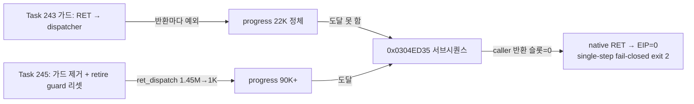

# Task 245 작업 로그: retire 시 inline-cache guard 리셋 구현 및 return fast-path 복원

## 수행 내용

1. **Phase 1 — Task 238 설계 구현**: `RetireWin32AotGuestPage`가 retire 페이지를
   guest target으로 학습한 설치형 guard(`0F 85`)를 초기 `E9 rel32 → miss tail` + `90`
   형태로 복원하도록 구현했다(`ResetInlineCacheGuardsTargetingPage`). 리셋 수는
   `Win32AotGuestPageRetireResult::guard_reset_count`로 보고하고
   `ThreadContext::aot_inline_cache_guard_reset_count`에 누적한다.
2. **Phase 2 — Task 243 dispatcher 가드 제거**: `BuildAotCodeCacheImage`의
   `is_saved_register_return` 분기를 제거해 저장 레지스터 epilogue RET도 4-entry
   return inline-cache를 받도록 복원했다.

## 검증

- 빌드: `scripts/build_win32_x86.ps1` (win32_x86_debug 전체) 2회 모두 성공.
- 구동: `repiu_supervisor_win32.exe pumpit1 180000`, `REPIU_EXECUTION_BACKEND=aot-dynamic`.

### Phase 1 (가드 유지 + guard 리셋) — 180초

- guard 리셋 실동작 확인: retire 3건에서 총 65개 guard 리셋
  (`page=0x030F5000 guards=29`, `0x030F4000 guards=23`, `0x030F3000 guards=13`).
- 리셋→재패치 프로토콜 확인: 이후 icache patch 로그에서 `guard=0xE9` 엔트리가
  재설치됨(`icache patch #14/#16`).
- 그러나 Task 243과 동일한 정체 재현: progress 22,920 / ret_dispatch 1,454,844 /
  reentry 1,508,767 (모두 180초). 정체점의 반환은 `ret_src=0x030EE1DA`(런타임 기록
  코드 영역의 저장 레지스터 epilogue) — **가드된 RET가 병목의 주범**임을 확정.

### Phase 2 (가드 제거) — 약 74.7초에 fail-closed 종료

| 지표 | Phase 1 @180s | Phase 2 @73s |
|---|---|---|
| progress | 22,920 | **90,489** |
| ret_dispatch | 1,454,844 | **1,009** |
| aot boundary/reentry | 1,508,732/1,508,767 | 136,571/136,614 |
| retire/quarantine | 26/4 | 35/5 |

- return dispatcher 폭주 소멸(1.45M → 1K), 진행 속도 약 10배.
- 실행이 fxMesa 렌더 상태 설정 깊숙이 도달: `_GRTEXCLAMPMODE@12`,
  `_GRTEXFILTERMODE@12`, `_GRTEXMIPMAPMODE@12`, `_GRTEXSOURCE@16`,
  `_GRTEXCOMBINE@28`, `_GRTEXDOWNLOADMIPMAPLEVEL@32`, `_GRHINTS@8` 최초 호출,
  `_GRCOLORCOMBINE@20` 4회, `_GRALPHACOMBINE@20` 5회 — Phase 1에서는 도달 못 함.

### Phase 2 종료 지점의 정밀 특성화 (Task 243 zero-EIP의 정정)

- 터미널 예외: `0x80000004`(single-step) at `EIP=0x00000000` — TF 인터리브 중
  네이티브 RET(`0x0304ED35`)이 `[ESP]=0`을 pop한 결과. Task 241/242의 null-EIP
  fail-closed 가드가 정상 작동해 caught exception(스레드 exit 2)으로 안전 종료.
- 라이브 바이트 창(로더 덤프): `... 6A 03 E8 64 FF 0A 00 83 C4 04 5D 5F 5E 59 5B [C3]`
  = `push 3; call 0x030FEC91(grColorCombine thunk); add esp,4; pop ebp/edi/esi/ecx/ebx; ret`.
- ESP 산술 검증: gate ESP `0x35D6D40` + 24(gate stdcall 정리) + 4(add esp,4)
  + 20(pops) = `0x35D6D70` = 폴트 시점 guest ESP와 정확히 일치.
  `_GRCOLORCOMBINE@20` 핸들러의 `Esp += 6*4` 정리는 **정상**이다.
- 따라서 **zero-EIP의 근인은 return fast-path도 Glide gate 스택 정리도 아니라,
  호출자 반환 주소 슬롯(`[0x35D6D70]`)의 내용이 0으로 되어 있는 데이터 손상**이다.
  Task 243의 dispatcher 가드는 실행을 정체시켜(progress 22K) 이 지점에 도달하지
  못하게 만든 것일 뿐 결함을 제거한 것이 아니었다(Task 234/235의 "더 일찍
  크래시해 뒤 오류가 사라져 보인" 패턴과 동일).

## 결론 및 다음 단계

1. 가드 제거(Phase 2)와 retire guard 리셋(Phase 1)은 **유지**한다. 가드 복원은
   결함을 숨기고 65배의 반환 비용만 재도입한다. 종료는 fail-closed로 안전하다.
2. 새 frontier: **누가 caller 반환 슬롯을 0으로 만드는가.** 후보 관측 기법은
   Task 223에서 결정적이었던 trap 백엔드 단일스텝 + 대상 슬롯 게이팅 관측.
   함수 영역은 `0x0304EC3C~0x0304ED35` 부근(fxMesa 상태 설정, 런타임 기록 코드,
   정적 이미지와 불일치 — 동적 스냅샷 필수).
3. trap 백엔드 180초 대조 구동 결과: **EIP=0 미재현**, 타임아웃까지 완주
   (progress 2,731,077, child_exit=124). 다만 마지막 Glide ordinal이
   `0x5E(_GRCULLMODE@4)`/`0x72`에 머물러 실패 서브시퀀스(4번째
   `_GRCOLORCOMBINE@20`, 반환 `0x0304ED2D`)에 도달했는지 확인할 수 없다
   (강제 종료라 Glide call trace 덤프 없음). **AOT 고유 여부는 미확정** —
   다음 조사에서 게이팅 관측으로 판별해야 한다.

# Task 245 Work Log: Retire-Time Inline-Cache Guard Reset and Return Fast-Path Restoration

## Work Performed

1. **Phase 1 — implemented design 238**: `RetireWin32AotGuestPage` now restores every
   installed guard (`0F 85`) whose guest-target immediate lies on the retired page to
   the initial `E9 rel32 → miss tail` + `90` form
   (`ResetInlineCacheGuardsTargetingPage`), reporting `guard_reset_count` and
   accumulating `ThreadContext::aot_inline_cache_guard_reset_count`.
2. **Phase 2 — removed the Task 243 dispatcher guard**: deleted the
   `is_saved_register_return` branch in `BuildAotCodeCacheImage` so saved-register
   epilogue RETs receive the four-entry return inline cache again.

## Verification

Two full `win32_x86_debug` builds passed. 180-second `aot-dynamic` supervisor runs:

- **Phase 1** confirmed the reset works (3 retires → 65 guards reset; later
  `icache patch` samples show `guard=0xE9` entries being reinstalled) but reproduced
  the Task 243 stall exactly: progress 22,920, ret_dispatch 1,454,844 — pinning the
  guarded RET as the bottleneck.
- **Phase 2** collapsed ret_dispatch to 1,009 and reached progress 90,489 by 73 s
  (~10x rate), advancing deep into fxMesa render-state setup (first calls of
  grTexClampMode/FilterMode/MipMapMode/Source/TexCombine/Hints, four
  grColorCombine calls), then ended at ~74.7 s with a fail-closed caught exception:
  single-step at `EIP=0` after the native RET at `0x0304ED35` popped `[ESP]=0`.
- Live-byte window and ESP arithmetic prove the `_GRCOLORCOMBINE@20` stdcall cleanup
  and the return fast path are both correct; the caller-return slot itself contains
  zero. The Task 243 guard had merely stalled execution short of this point — it
  never fixed the defect.

## Conclusions

Keep both phases. The new frontier is finding what zeroes the caller-return slot in
the function around `0x0304EC3C–0x0304ED35` (runtime-written fxMesa code; static
image differs — dynamic snapshots required). Next: a 180-second trap-backend control
run to decide whether the corruption is AOT-specific, then a gated stack-slot
observation (the Task 223 technique).
