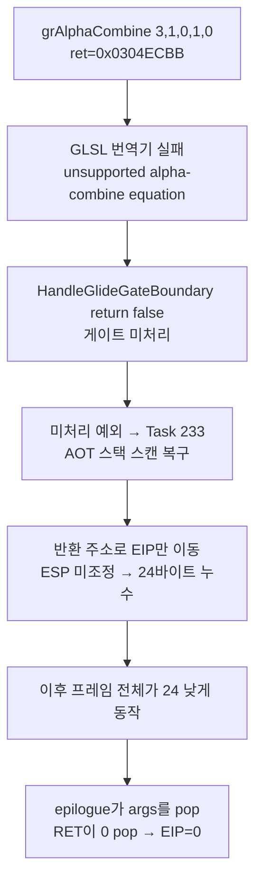

# Task 246 작업 로그: zero return-slot 증거 덤프와 근인 확정

## 수행 내용

1. `DumpZeroReturnEvidence`(설계 246) 구현: 반환 target==0 감지 시(dispatcher 경로)와
   zero-EIP fail-closed 경로(`execution_trampoline`) 양쪽에서 게스트 스택 64 dwords,
   라이브 코드 창 96바이트, 추적 call frame 8개, 최근 return trace 8개를 stderr로
   덤프(최초 4회).
2. Glide gate 진입 전수 로그(호출량이 61회로 작음)와 미처리(reject) 사유 로그를
   `HandleGlideGateBoundary`에 추가.
3. `aot-dynamic` 120초 채증 구동 2회(1회차는 dispatcher 경로만 계측되어 미발화,
   2회차에서 fail-closed 경로 패킷 포착; 3회차에서 게이트 로그 확보).

## 확인된 증거와 근인 사슬

증거 패킷(결정적 재현, ~74.7초):

```
esp=0x035D6D74 (RET 직후), 팝된 슬롯 [0x035D6D70]=0
stack 0x035D6D54: 00000000 0304ECBB 00000003 00000001 00000000 00000001 00000000 00000000
stack 0x035D6D74: 035D6DE8 00000000 0383E2D0 0383C640 038B40D8 0304F314 ...
```

- **진짜 호출자 반환 주소 `0x0304F314`가 `[0x035D6D88]` — RET이 읽은 슬롯보다
  정확히 24바이트 위 — 에 온전히 존재**(Task 243 관측과 일치).
- epilogue의 5개 pop이 저장 레지스터 대신 **소진되지 않은 이전 게이트 호출 스택
  이미지**(`ret=0x0304ECBB`, args `3,1,0,1,0`)를 pop — 폴트 레지스터
  (EBX=0, ECX=1, ESI=0, EDI=1)와 완전 일치.
- 게이트 전수 로그: **entry #59/#60 = `_GRALPHACOMBINE@20` ret=0x0304ECBB, 동일
  ESP(0x035D6D58)로 2회 진입, 미처리**(entries 61 / handled 59). 이후 #61
  `_GRCOLORCOMBINE@20`의 gate ESP가 정상치보다 정확히 24 낮음(0x035D6D40).

**근인 사슬 (확정):**



- `SetAlphaCombine` 실패 시 `_GRALPHACOMBINE@20` 핸들러가 `return false`로 게이트를
  미처리로 남긴다(color-combine과 달리 unsupported 유지 정책 부재).
- 미처리 게이트 예외는 Task 233의 AOT DEP 복구(스택 스캔)로 흘러들어, `[ESP]`의
  게스트 주소(=반환 주소)로 **ESP를 조정하지 않고** EIP만 옮긴다 — stdcall
  24바이트(ret+args)가 그대로 남는다.
- 이 스택 스캔 복구는 Task 243이 금지한 "dispatcher 스택 검색 복구"와 같은 계열의
  ABI 훼손 경로로, 후속 과제에서 게이트 주소에 대해 차단하는 검토가 필요하다.

## 검증

- 빌드 3회 성공(win32_x86_debug 전체).
- 채증 구동: `scratch_run246.log`(미발화), `scratch_run246b.log`(패킷 포착),
  `scratch_run246c.log`(게이트 전수 로그, reject 0건으로 alphaCombine 실패 분기
  미계측임을 역으로 확정).
- 수정은 Task 247에서 수행(alpha-combine 유지 정책).

# Task 246 Work Log: Zero Return-Slot Evidence Dump and Root Cause

Implemented the design-246 evidence packet at both the dispatcher return path and
the zero-EIP fail-closed path, plus full Glide gate entry/reject logging (only 61
entries per run). The deterministic ~74.7 s reproduction shows the true caller
return address `0x0304F314` intact exactly 24 bytes above the slot the RET read,
and the epilogue popping an unconsumed gate-call image (`ret=0x0304ECBB`, args
`3,1,0,1,0`) instead of saved registers. Gate logs pin entries #59/#60 as
`_GRALPHACOMBINE@20` at ret `0x0304ECBB` entered twice at the same ESP and left
unhandled (61 entries / 59 handled); the next gate's ESP is exactly 24 bytes low.

Root cause chain: the GLSL translator rejects the alpha-combine equation →
the handler returns false (no retain policy, unlike color combine) → the
unhandled gate exception reaches the Task 233 AOT stack-scan recovery, which
moves EIP to the stack-scanned return address without adjusting ESP → the
24-byte stdcall frame leaks → the epilogue pops arguments into registers and the
RET pops zero → EIP=0 fail-closed exit. The stack-scan recovery is the same
ABI-corrupting class Task 243 prohibited for dispatch and needs a follow-up
review for gate addresses. The fix lands in Task 247 (alpha-combine retain
policy).
