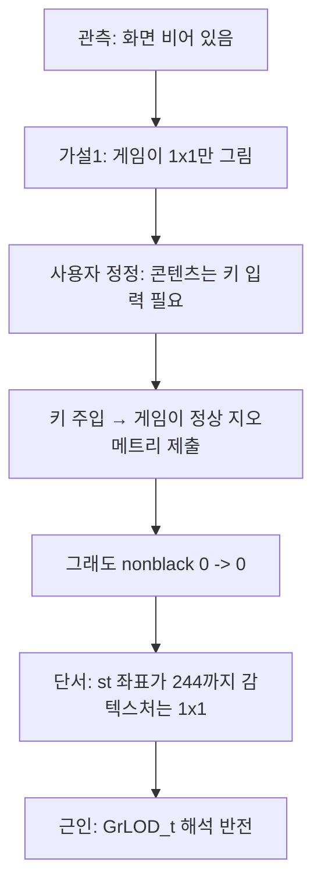

# 작업 로그 — GrLOD_t 열거값 해석 정정으로 첫 콘텐츠 렌더 달성 / Work Log — GrLOD_t Fix Lands the First Real Content Render

* 작성일 / Date: 2026-07-22 (Task 258)
* 작업 지시 / Work order: `docs/work-orders/20260722-258-glide-lod-enumeration-fix.md`
* 브랜치 / Branch: `claude/glide-api-call-audit` (커밋 `9bfde75`)

## 1. 추적 경로 / How It Was Found

"삼각형을 그려도 화면에 아무것도 안 보인다"는 보고에서 출발해, 잘못된 가설 두 개를
거쳐 근인에 도달했다. 경로를 남기는 이유는 **두 오판 모두 관측 지표 하나만 보고
단정한 데서 비롯**됐기 때문이다.

**오판 1 — "회귀".** v0.0.75가 17,280픽셀을 그리고 현재가 1픽셀이므로 회귀라고
보고했다. 실제로는 반대였다: v0.0.75는 I/O 입력을 **오독(눌린 것으로)** 해 키를
눌러야 나오는 화면이 강제로 떠 있었고, v0.0.77/78의 입력 폴링 수정이 **정상 동작**을
복원한 것이다. 픽셀 수라는 단일 지표를 "많으면 정상"으로 해석한 것이 잘못이었다.
이등분 자체는 유효해 `5864bff`(텍스처 포맷 검증)의 무해함을 확인했다.

**오판 2 — "정점 디코드 오류".** 정점 색 필드가 쓰레기값이라 60바이트 stride나
오프셋을 의심했다. 그러나 같은 오프셋의 x/y/oow는 전부 정상이고(`479.9375` =
`480 − 1/16`은 Glide 서브픽셀 스냅 값), 표준 2-TMU `GrVertex`와 일치하며, 과거
Task 254가 같은 주소에서 정상값을 읽었다. 디코드는 옳았다.

## 2. 근인 (확인됨) / Root Cause

`GrLOD_t`는 크기의 log2가 아니라 **열거값**이고 **0이 256**이다. 두 계산식이 LOD를
지수로 직접 써서 모든 텍스처가 뒤집혔다: 관측된 `largeLod=0, aspect=1x1`은
**256×256**인데 **1×1**로 생성됐다.

**결정적 증거.** 게임이 제출한 텍스처 좌표 `st=(193,156)`, `(226,156)`, `(244,·)` —
1×1에는 존재할 수 없고 256폭 텍스처를 가리킨다.

**2차 피해.** `grTexTextureMemRequired`가 같은 계산을 공유하고 게임은 그 값으로
자기 TMU 할당을 정한다. 256×256에 "8바이트"를 보고하자 게임이 텍스처를 8바이트
간격으로 배치했고, Task 255는 그 간격을 **1×1의 확증으로 기록**했다. 우리 버그가
만든 증거로 그 버그를 정당화한 순환 논리였다.

## 3. 수정 / Changes

* `src/hle/glide_texture_decode.cpp` — `LodEdgeLog2(lod) = 8 - lod` 도입,
  aspect ratio를 짧은 변에 적용.
* `src/hle/glide_hle.cpp` — `CalculateGlideTextureMemoryRequired`에 동일 변환,
  mipmap 순회를 `large_lod → small_lod` 방향으로 정정, 유효성 검사를
  `large_lod <= small_lod`로 반전.

## 4. 검증 (확인됨) / Verification

콘텐츠 화면이 키 입력을 요구하므로 `keybd_event`로 JAMMA 입력을 합성했다
(`port_io_emulator.cpp`가 `GetAsyncKeyState`로 전역 물리 키 상태를 읽으므로 창
포커스와 무관하게 전달된다). 게스트 수신 확인:
`[repiu-input] TEST PRESSED port=0x02A9 value=0x7F` (bit 7 하강 = `~0x80`).

| 항목 | 수정 전 | 수정 후 |
|---|---|---|
| `StoreTexture` 크기 | 1×1 | **256×256** |
| 게임의 텍스처 주소 간격 | 8바이트 | **0x2000** |
| 삼각형별 백버퍼 누적 | `0 → 0` | **`0 → 122 → 166 → … → 760`** |
| 프레임 비검정 픽셀 | 0 | **1,765 / 307,200** (avg-rgb 133,133,133) |
| 안정성 | — | swap #200까지 유지 |
| 거부 / 미처리 게이트 | 0 / 0 | **0 / 0 유지** |

저장된 텍스처 2종: `addr=0 format=10(RGB565) 256×256` texel0 `(140,150,148,255)`,
`addr=0x2000 format=12(ARGB4444) 256×256` texel0 `(255,255,255,0)`. 앞의 값은
Task 255가 "1×1 텍스처의 유일한 텍셀"로 기록했던 것으로, 실제로는 256×256 이미지의
첫 픽셀이었다.

## 5. 미해결 / Open

* **정점 색 필드가 여전히 유효 범위 밖.** 현재 콘텐츠는 `grColorCombine(function=3
  =SCALE_OTHER, other=1=TEXTURE)`이라 정점색이 출력에 쓰이지 않아 무해하다. 게임이
  쓰지 않는 필드를 채우지 않는 것인지, 색 오프셋만 어긋난 것인지 **미확정**.
  LOCAL combine을 쓰는 콘텐츠가 나오면 그때 확정된다.
* **LFB 실데이터 검증 미완.** 이번 구동은 입력에 따라 LFB를 쓰지 않는 경로로
  진입했다. Task 257의 블릿·seeding은 여전히 실데이터 미검증이다.
* **텍스처 주소 간격 0x2000의 의미 미확정.** 256×256×2 = 131,072바이트인데 게임은
  8,192바이트 간격으로 배치한다. mipmap/evenOdd 분할이나 부분 다운로드 가능성이
  있어 `grTexTextureMemRequired` 인자(`GrTexInfo` 내용) 실측이 필요하다.
* **진단 코드 정식화 여부.** `REPIU_GLIDE_CALL_AUDIT`, `REPIU_GLIDE_DRAW_DIAG`는
  env-gated이고 출력이 상한 있으나, 상시 컴파일 유지할지 결정이 필요하다.

## 6. 회고 / Retrospective

두 번의 오판 모두 **단일 지표를 근거로 상태를 단정**한 데서 나왔다(픽셀 수가 많으면
정상, 색이 이상하면 디코드 버그). 이번에 근인으로 이끈 것은 **서로 다른 두 관측의
불일치**였다 — "텍스처는 1×1인데 게임이 보내는 텍스처 좌표는 244까지 간다". 교차
검증이 가능한 지표를 함께 남기는 계측이 유효했다.

또한 Task 255의 순환 논리는 **우리 구현이 만든 관측을 외부 사실로 취급**했을 때
생겼다. 게스트 동작이 우리 반환값에 의존하는 API(`grTexTextureMemRequired` 등)에서는
관측을 근거로 쓰기 전에 그 관측이 우리 출력의 함수인지 먼저 확인해야 한다.

---

## English Summary

Tracked "triangles draw but nothing appears" to a `GrLOD_t` misinterpretation
through two wrong hypotheses, both caused by reading a single metric as a verdict.

First wrong call: reporting a regression because v0.0.75 rendered 17,280 pixels
and current builds render 1. The truth was the opposite — v0.0.75 misread JAMMA
input as pressed, forcing up a screen that requires key input, and the v0.0.77/78
polling fix restored correct behavior. Second wrong call: suspecting the vertex
decode because color fields held garbage, when x/y/oow at the same offsets were
all valid and matched the standard 2-TMU `GrVertex`.

The root cause is that `GrLOD_t` is an enumeration (`GR_LOD_256` = 0), not a log2
size, so every texture was inverted: the observed `largeLod=0`/`1x1` download is
256x256 but was built 1x1. The decisive clue was a contradiction between two
observations — textures were 1x1 while the game submitted texture coordinates up
to 244. Because `grTexTextureMemRequired` shares the math and the guest sizes its
own allocations from it, the error propagated into the game's 8-byte texture
spacing, which Task 255 had recorded as proof the textures were 1x1 — a circular
argument built on our own output.

Verified with synthesized JAMMA input: textures store as 256x256, the game
allocates them 0x2000 apart, per-triangle back-buffer readback climbs 0 → 760,
and the frame settles at 1,765 non-black pixels stable through swap #200, with
zero rejected or unhandled gates. Open: the still-garbage vertex color fields
(harmless under SCALE_OTHER), end-to-end LFB validation, and the meaning of the
0x2000 texture spacing.
