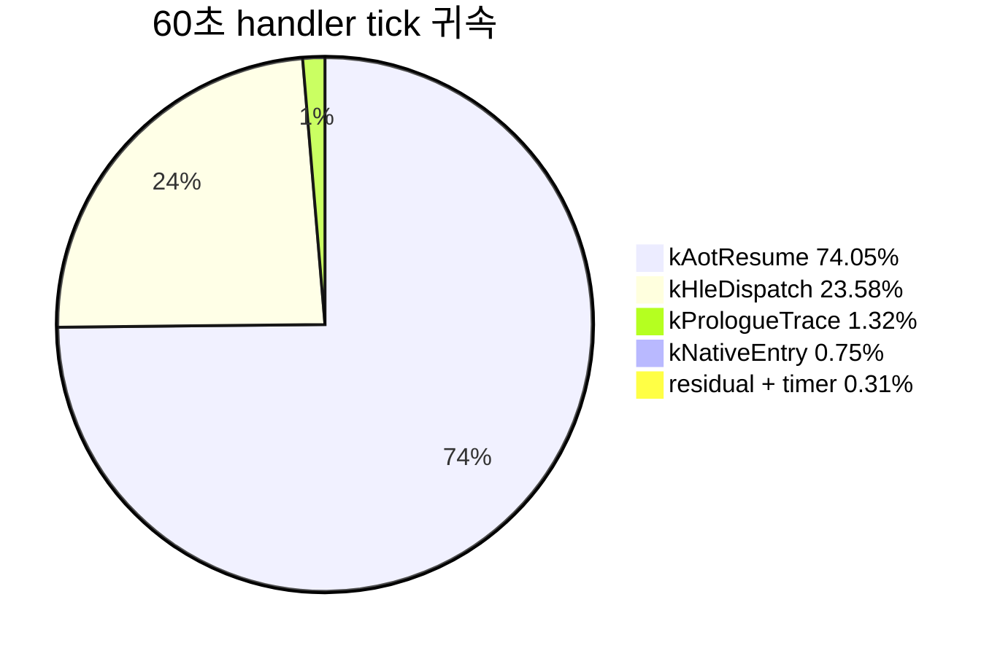

# 20260727-322 작업 로그: Single-step handler 단계별 비용 귀속 / Work log: Single-step handler stage attribution

설계: [20260727-322-single-step-handler-stage-attribution.md](../design/20260727-322-single-step-handler-stage-attribution.md)

작업 지시: [20260727-322-single-step-handler-stage-attribution.md](../work-orders/20260727-322-single-step-handler-stage-attribution.md)

## 한국어

### 구현 개요

`HandleSingleStepTrace`를 상호 배타적인 5개 단계로 나누어 count와 TSC tick을 전역 및
guest EIP별로 기록했습니다. 관측 전용이며 guest 실행 의미는 변경하지 않았습니다.

1. `single_step_hotspot_profile.h/.cpp`
   - `SingleStepProfileStage`(`kPrologueTrace`, `kHleDispatch`, `kAotResume`,
     `kInterruptInjection`, `kNativeEntry`)와 `Win32SingleStepStageTally` 추가.
   - entry/profile/sample/snapshot에 `stage_counts`/`stage_cycles` 배열 추가.
   - RAII `SingleStepHotspotStageScope` 추가. 부모 scope 비활성 시 `__rdtsc`를
     호출하지 않으므로 profile OFF 경로 비용은 분기 하나입니다.
2. `execution_trampoline.cpp`
   - 매 step마다 무조건 실행되던 진단 계측(execution probe/trace, LINEXE EIP 사다리,
     shadow register mirror, Route A 분류)을 `RecordSingleStepDiagnostics`로 분리.
     본문은 그대로이고 함수 경계만 이동했습니다.
   - 다섯 구간을 각각 단계 scope로 감쌌습니다. 단계는 중첩하지 않습니다.
3. `single_step_hotspot_profile_probe.cpp`
   - 단계 누적, 전역/entry 일치, tally 없는 표본의 무누적, null profile 무반응,
     `sum(stage_cycles) <= total_cycles` 검증 추가.
4. `main.cpp`
   - 종료 summary에 전역 단계별 count/cycle과 파생 residual을 출력.
   - cycle hotspot 항목마다 단계별 cycle을 추가 출력.

### 검증 결과

1. `scripts/build_win32_x86.ps1` Win32 x86 Debug 전체 빌드 통과. 신규 경고 없음
   (기존 C4819 코드페이지 경고만 유지).
2. `repiu_aot_probe build/runtime_mounts/pumpit1/PIU/PIU.EXE` 전체 통과.
   `single_step_hotspot_profile_stages=true` 포함 모든 `*_all=true`.
3. 60초 `aot-dbt` 실행 두 번(profile ON/OFF). 두 실행 모두 정상 timeout,
   AOT legacy fallback 0, exception dispatch malformed 0, EEPROM SHA-256
   `A1FC1D120EF12DE4FB3608551750F93E02F911F26A3DDF9054ABCE4846652570`으로
   fixture와 일치했습니다.

| 실행 | progress | single-step | AOT boundary | profile sample |
|---|---:|---:|---:|---:|
| control OFF | 10,342 | 56,292 | 45,983 | 0 (enabled=false) |
| profile ON | 9,792 | 53,628 | 45,899 | 53,628 |

OFF snapshot은 `enabled=false`이고 count/cycle이 모두 0이었습니다. 계측 부담은
progress `-5.32%`, single-step `-4.73%`입니다. 단일 쌍 표본이므로 이 값은 계측 비용의
상한 참고치로만 사용합니다.

### 단계별 분포 (60초, profile ON)

표본 53,628개, distinct EIP 717개, overflow 0. 총 handler tick은
`32,730,038,317`입니다.

| 단계 | count | TSC tick | 전체 tick 비율 | 평균 tick/호출 |
|---|---:|---:|---:|---:|
| `kPrologueTrace` | 53,628 | 433,120,960 | 1.32% | 8,076 |
| `kHleDispatch` | 53,628 | 7,716,478,628 | 23.58% | 143,891 |
| **`kAotResume`** | **39,335** | **24,233,585,450** | **74.05%** | **616,079** |
| `kInterruptInjection` | 14,284 | 12,071,488 | 0.04% | 845 |
| `kNativeEntry` | 14,254 | 245,876,061 | 0.75% | 17,249 |
| `residual` (파생) | — | 88,905,730 | 0.27% | — |

outcome 축으로는 HLE가 event의 73.36%(39,344), tick의 98.34%
(`32,185,543,457`)였습니다. HLE tick 안에서 `kAotResume`은 75.29%입니다.

### 판정

설계가 사전에 고정한 gate 표의 첫 행이 성립했습니다.

* `kAotResume`이 HLE tick의 75.29%로 50% 기준을 크게 넘었습니다.
* 따라서 **병목은 HLE emulate 본체가 아니라 번역 캐시 재진입 경로**입니다.
* 다음 작업은 로드맵 1단계 — block entry 패딩과 범용 dispatch stub으로
  `INT3` sentinel 및 재해석 비용을 제거하는 것 — 으로 확정합니다.

`kPrologueTrace`는 1.32%로 20% gate에 한참 못 미쳤습니다. 상시 진단 계측을 런타임
플래그 뒤로 옮기는 선행 소작업은 **불필요**하다고 판정하며, 착수 전 가설이었던
"진단 계측이 hot path 비용을 지배한다"는 기각합니다.

### 확인됨 / Confirmed

* `TryResumeAotAfterHandledHle` 한 호출의 평균은 `616,079 tick`(약 205us @3GHz)입니다.
  이 규모는 cache 조회만으로 설명되지 않으며 `docs/analysis/aot-code-cache-emission.md`가
  기록한 평균 cache 생성 비용 `7,847.2us`와 정합적입니다.
* Task 309의 미확정 항목("HLE latency의 원인이 순차 predicate/decode인지")은
  부분적으로 해소됐습니다. Task 312의 opcode-directed dispatcher 적용 이후에도
  `kHleDispatch` 평균은 `143,891 tick`으로 여전히 큽니다. 그러나 전체의 23.58%로
  `kAotResume`보다 작습니다.

### 미확정 / Unresolved

* `kAotResume` 내부에서 cache lookup, quarantine 판정, 동적 번역, worker publication의
  비중은 아직 나누지 않았습니다. 로드맵 1단계 설계 시 추가 세분화가 필요합니다.
* `kHleDispatch` 평균 `143,891 tick`의 내역도 미확정입니다. handler 본체인지 그 안의
  selector table 조회나 device emulation인지 확인하지 않았습니다.
* 이번 실행의 절대값은 Task 309와 직접 비교할 수 없습니다. Task 310~312가 segment
  read와 port I/O를 AOT fast-path로 옮겼고 Task 313~321이 Glide 경로를 크게 바꿨기
  때문에 single-step 모집단 자체가 `272,543`에서 `53,628`로 달라졌습니다. 남은
  single-step의 평균 비용이 오히려 커진 원인은 이번 범위에서 규명하지 않았습니다.

---

## English

### Implementation

`HandleSingleStepTrace` is split into five mutually exclusive stages recorded per
guest EIP and globally. The change is observation-only and does not alter guest
execution semantics.

The profile header and source gain `SingleStepProfileStage`,
`Win32SingleStepStageTally`, stage arrays on the entry/profile/sample/snapshot
structures, and a RAII `SingleStepHotspotStageScope` that issues no `__rdtsc` when
the parent scope is inactive. In the trampoline, the unconditional per-step
diagnostics (execution probe/trace, LINEXE EIP ladder, shadow register mirror, Route
A classification) moved into `RecordSingleStepDiagnostics` with an unchanged body so
the region could be wrapped without re-indenting, and the five regions are each
wrapped in a non-nested stage scope. The probe verifies stage accumulation, entry and
global agreement, no accumulation without a tally, an inert null profile, and
`sum(stage_cycles) <= total_cycles`. The loader summary prints global stage counts
and cycles with a derived residual, plus per-stage cycles on cycle hotspot rows.

### Verification

The full Win32 x86 Debug build passed with no new warnings, and `repiu_aot_probe`
reported every `*_all=true` including the new
`single_step_hotspot_profile_stages=true`. Two 60-second `aot-dbt` runs with the
profile off and on both reached their timeout with zero AOT legacy fallback, zero
malformed dispatch, and an EEPROM SHA-256 matching the fixture. Control progress was
10,342 against 9,792 with the profile on (`-5.32%`), and single steps 56,292 against
53,628 (`-4.73%`); as a single pair this bounds rather than measures instrumentation
cost. The disabled snapshot reported `enabled=false` with all counters at zero.

### Result

Across 53,628 samples over 717 distinct EIPs with zero overflow and
`32,730,038,317` total handler ticks, `kAotResume` took 74.05% of all ticks and
75.29% of HLE ticks, averaging `616,079 ticks` (about 205us at 3GHz) per call.
`kHleDispatch` took 23.58%, `kPrologueTrace` 1.32%, `kNativeEntry` 0.75%,
`kInterruptInjection` 0.04%, and the derived residual 0.27%.

This satisfies the first row of the decision gate fixed in the design: the bottleneck
is the translation cache re-entry path, not the HLE emulation body, so roadmap stage 1
(block entry padding plus a general dispatch stub) is confirmed as the next task. At
1.32%, `kPrologueTrace` falls far below the 20% gate, so moving the always-on
diagnostics behind a runtime flag is unnecessary and the pre-task hypothesis that
instrumentation dominates the hot path is rejected.

### Unresolved

The split inside `kAotResume` between cache lookup, quarantine decisions, dynamic
translation, and worker publication is not yet attributed and needs finer measurement
during roadmap stage 1 design. The composition of the `143,891` average
`kHleDispatch` ticks is likewise unattributed. Absolute values are not comparable to
Task 309 because Tasks 310-312 moved segment reads and port I/O onto AOT fast paths
and Tasks 313-321 substantially changed the Glide path, shifting the single-step
population from 272,543 to 53,628; why the surviving steps became more expensive on
average was not investigated in this scope.
