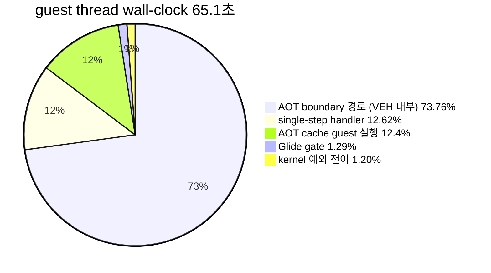

# 20260727-323 작업 로그: 전체 실행 시간 귀속과 kAotResume 분해 / Work log

설계: [20260727-323-whole-run-execution-time-attribution.md](../design/20260727-323-whole-run-execution-time-attribution.md)

작업 지시: [20260727-323-whole-run-execution-time-attribution.md](../work-orders/20260727-323-whole-run-execution-time-attribution.md)

## 한국어

### 결론 요약

**guest thread wall-clock의 86.38%가 VEH handler 본문 안에서 소비되며, 그중
73.76%p는 `HandleSingleStepTrace` 바깥의 AOT boundary 경로입니다. 예외 전이 비용은
1.20%, Glide gate는 1.29%에 불과합니다.** 병목은 TF도 VEH 메커니즘도 예외 횟수도
렌더링도 아니고, handler 안에서 반복되는 **O(n) 선형 탐색**입니다.

이에 따라 "TF/VEH를 걷어낸다"는 방향 자체가 현재 병목과 맞지 않음이 확인됐습니다.

### 구현 개요

1. **Part A** — `SingleStepProfileStage`에 `kSegmentWriteProbe`,
   `kQuarantineCheck`, `kCacheLookup`, `kSpanSafety`를 append하고(기존 인덱스 보존),
   `ThreadContext::active_hotspot_scope`로 열린 sample을 공개해
   `TryResumeAotAfterHandledHle`의 네 구간을 다른 translation unit에서 귀속시켰습니다.
2. **Part B** — 신규 `execution_time_profile` 모듈(`REPIU_EXECUTION_TIME_PROFILE`
   opt-in)을 추가하고 guest 실행 구간, `DispatchGuestException`,
   `HandleGlideGateBoundary`, `HandlePortIoInstruction`,
   `HandleTracedDosInterrupt21`에 bucket을 연결했습니다.
3. **Part B-2** — `exception_transition_calibration_probe`가 `INT3`와 TF single-step
   왕복 1회 비용을 합성 측정합니다.
4. Task 322 설계 문서와 `docs/analysis/` 두 문서에 잘못된 인과 귀속 정정을 반영했습니다.

### 구현 중 발견한 계측 결함 두 가지

* `GuestEntryThreadProc`은 `__try`를 사용하므로 MSVC가 같은 함수 안의 unwinding
  객체를 거부합니다(C2712). 분모 scope를 별도 helper 함수로 분리했습니다.
* 그럼에도 첫 두 실행에서 `guest-run`이 0이었습니다. 실행이 **timeout으로 종료**되면
  guest thread가 반환하지 않아 RAII 소멸자가 실행되지 않기 때문입니다. profile에
  열린 구간의 시작 tick을 저장하고 snapshot 시점에 닫도록 수정했습니다. 이 결함을
  고치기 전 두 실행의 Part B 수치는 폐기했습니다.

### 검증 결과

1. Win32 x86 Debug 전체 빌드 통과.
2. `repiu_aot_probe build/runtime_mounts/pumpit1/PIU/PIU.EXE` 전체 통과.
   신규 `single_step_hotspot_profile_sub_stages=true`,
   `exception_transition_calibration_all=true` 포함 모든 `*_all=true`.
3. 60초 `aot-dbt` 실행 ON/OFF 각 1회. 두 실행 모두 정상 timeout, AOT legacy
   fallback 0, malformed dispatch 0, diagnostic progress 8,199로 동일,
   EEPROM SHA-256 `A1FC1D...52570`으로 fixture와 일치했습니다.
   OFF snapshot은 두 profile 모두 `enabled=false`이고 카운터가 0이었습니다.

### Part A — `kAotResume` 내역 (60초, profile ON)

`kAotResume` 총 `12,987,145,872 tick`.

| 하위 단계 | count | TSC tick | `kAotResume` 대비 |
|---|---:|---:|---:|
| `kSegmentWriteProbe` | 21,547 | 249,595,268 | 1.92% |
| `kQuarantineCheck` | 10,876 | 156,083,004 | 1.20% |
| **`kCacheLookup`** | **10,876** | **11,395,704,478** | **87.75%** |
| `kSpanSafety` | 10,876 | 675,746,920 | 5.20% |
| residual (분기·early-out) | — | 510,016,202 | 3.93% |

`FindAotCacheAddress` 한 번의 평균은 `1,047,784 tick`, 2.5GHz 기준 약 **419us**입니다.

**확인됨:** 설계가 등록한 Part A gate 첫 행이 성립했습니다. 원인은 동적 번역도,
Zydis decode도, quarantine 판정도 아니고 `placement.address_map` 선형 탐색입니다.

### Part B — guest thread wall-clock 귀속 (분모 `162,848,392,105 tick`, 약 65.1초)

| bucket | TSC tick | 비율 |
|---|---:|---:|
| **`kVehTotal`** | **140,669,834,536** | **86.38%** |
| `kGlideGate` | 2,104,393,724 | 1.29% |
| `kDosService` | 236,072,055 | 0.14% |
| `kPortIoDevice` | 24,285,813 | 0.01% |
| `kUnaccounted` (cache 실행 + kernel 전이) | 22,178,557,569 | 13.62% |

Part A/B를 합치면 VEH 내부가 다시 갈립니다. `HandleSingleStepTrace` 전체는
`20,559,155,309 tick`(12.62%)이므로, **VEH 안이지만 single-step handler 밖인 구간이
`120,110,679,227 tick` = 전체의 73.76%** 입니다. 이는 `INT3` AOT boundary 경로이며
이번 실행의 boundary는 30,099회였습니다.

### Part B-2 — 예외 전이 교정

| 종류 | 왕복 1회 비용 |
|---|---:|
| `INT3` | 32,635 tick (약 13.1us) |
| TF single-step | 34,015 tick (약 13.6us) |

**추정:** VEH 진입 59,175회에 약 33,000 tick을 곱하면 `1.95e9 tick`, 전체의 약
**1.20%** 입니다. 따라서 `kUnaccounted` 13.62% 중 약 12.4%p가 AOT cache 내 실제
guest 실행이고, kernel 전이는 1.20%p입니다.

### 판정

설계가 사전 고정한 gate 결과입니다.

| gate | 관측 | 판정 |
|---|---:|---|
| Part A `kCacheLookup` >= 50% | 87.75% | **성립.** `FindAotCacheAddress`를 해시 맵으로 교체 |
| Part B `kGlideGate` >= 30% | 1.29% | 기각. 렌더 경로는 병목이 아님 |
| Part B kernel 전이 >= 30% | 1.20% | **기각. 예외 횟수는 병목이 아님** |
| Part B `kUnaccounted` >= 50% | 13.62% | 기각 |

**확인됨:** TF/VEH 제거 로드맵의 전제 — "예외 왕복 비용이 지배적"— 는 측정으로
기각됩니다. 예외 전이는 1.20%이므로 TF와 `INT3`를 **전부** 제거해도 상한은 약
1.012배입니다. 반면 handler 본문은 86.38%이고 그 안의 지배 항목은 선형 탐색입니다.

**확인됨:** 다음 작업은 자료구조 교체입니다. `FindAotCacheAddress`를 guest 주소
해시 맵으로 바꾸면 single-step 경로(`kCacheLookup` 7.0%p)와 AOT boundary
경로(73.76% 중 상당 부분)가 동시에 이득을 받습니다.

### 미확정 / Unresolved

* VEH 내부 73.76%(AOT boundary 경로)의 세부 귀속은 하지 않았습니다.
  `ResolveAotTransferTarget`이 같은 `FindAotCacheAddress`를 호출하므로 같은 원인일
  가능성이 높지만, 구간 계측 없이는 확정하지 않습니다. 해시 맵 교체 전후 A/B가
  이를 직접 검증합니다.
* Debug 빌드 측정입니다. MSVC Debug의 `std::vector` 순회는 iterator debug check로
  크게 느려지므로, Release에서 선형 탐색의 비중은 줄어듭니다. 다만 O(n)이라는
  점근 성질은 빌드 구성과 무관합니다.
* 이번 두 실행의 diagnostic progress는 8,199로 동일했습니다. progress가 이 구간에서
  포화 상태일 수 있으므로 처리량 지표로 사용하지 않았습니다.

---

## English

### Summary

86.38% of guest-thread wall clock is spent inside the VEH handler body, of which 73.76
percentage points lie outside `HandleSingleStepTrace` on the `INT3` AOT boundary path.
Exception transitions cost 1.20% and the Glide gate 1.29%. The bottleneck is therefore
neither TF, nor the VEH mechanism, nor exception frequency, nor rendering: it is an O(n)
linear scan repeated inside the handler. The premise behind removing TF and VEH does not
match the measured bottleneck.

### Implementation

Part A appends four sub-stages to `SingleStepProfileStage` (preserving existing indices)
and publishes the open sample through `ThreadContext::active_hotspot_scope` so
`TryResumeAotAfterHandledHle` can attribute from another translation unit. Part B adds an
`execution_time_profile` module behind `REPIU_EXECUTION_TIME_PROFILE`, wired at the guest
run window, `DispatchGuestException`, `HandleGlideGateBoundary`,
`HandlePortIoInstruction`, and `HandleTracedDosInterrupt21`. Part B-2 adds a synthetic
calibration probe. The Task 322 design and both analysis documents received the
correction to their false causal attribution.

Two instrumentation defects surfaced during implementation. `GuestEntryThreadProc` uses
`__try`, which MSVC rejects alongside objects requiring unwinding (C2712), so the
denominator scope moved into a helper. Even then the denominator stayed zero, because the
run ends by timeout and the guest thread never returns, so the RAII destructor never
fires; the profile now records the open interval's start and the snapshot closes it. Part
B figures from the two runs before that fix were discarded.

### Verification

The full Win32 x86 Debug build passed and `repiu_aot_probe` reported every `*_all=true`
including the new `single_step_hotspot_profile_sub_stages` and
`exception_transition_calibration_all`. One 60-second `aot-dbt` run each with the profiles
on and off both reached their timeout with zero AOT legacy fallback, zero malformed
dispatch, identical diagnostic progress of 8,199, and an EEPROM SHA-256 matching the
fixture. The off run reported both profiles disabled with zero counters.

### Results

Within `kAotResume` (`12,987,145,872` ticks), `kCacheLookup` held `11,395,704,478` ticks or
87.75% across 10,876 calls, averaging `1,047,784` ticks (about 419us) per
`FindAotCacheAddress`. `kSpanSafety` took 5.20%, `kSegmentWriteProbe` 1.92%,
`kQuarantineCheck` 1.20%, and inter-stage residual 3.93%. The cause is the linear
`placement.address_map` scan, not dynamic translation, Zydis decoding, or quarantine
checks.

Against a `162,848,392,105` tick denominator (about 65.1 seconds), `kVehTotal` held 86.38%,
`kGlideGate` 1.29%, `kDosService` 0.14%, `kPortIoDevice` 0.01%, and `kUnaccounted` 13.62%.
Since the whole of `HandleSingleStepTrace` accounts for `20,559,155,309` ticks (12.62%),
`120,110,679,227` ticks or 73.76% of wall clock sits inside the VEH but outside the
single-step handler, on the `INT3` AOT boundary path across 30,099 boundaries.

Calibration priced one `INT3` round trip at 32,635 ticks and one TF single step at 34,015.
Multiplying 59,175 VEH entries by roughly 33,000 estimates kernel transition at
`1.95e9` ticks, about 1.20% of wall clock, leaving roughly 12.4 percentage points of the
unaccounted bucket as real guest execution inside the AOT cache.

### Gates and decision

Part A's first gate holds at 87.75%, selecting a hash-map replacement for
`FindAotCacheAddress`. Every Part B gate is rejected: Glide gate at 1.29%, kernel
transition at 1.20%, and unaccounted at 13.62%. The premise that exception round trips
dominate is therefore rejected by measurement — removing every TF and `INT3` exception
would bound improvement at roughly 1.012x — while the handler body holds 86.38% and its
dominant term is a linear scan. The next task replaces that data structure, which benefits
the single-step path and the AOT boundary path at the same time.

### Unresolved

The 73.76% inside the VEH but outside the single-step handler is not yet attributed at
sub-stage granularity. `ResolveAotTransferTarget` calls the same `FindAotCacheAddress`, so
the same cause is likely, but this is not confirmed without direct instrumentation; an A/B
across the hash-map change will test it directly. The measurement is a Debug build, where
MSVC iterator debug checks inflate `std::vector` traversal, so the linear scan's share
will shrink in Release even though its O(n) behavior is build-independent. Diagnostic
progress was identical at 8,199 in both runs and may be saturated in this phase, so it was
not used as a throughput metric.
