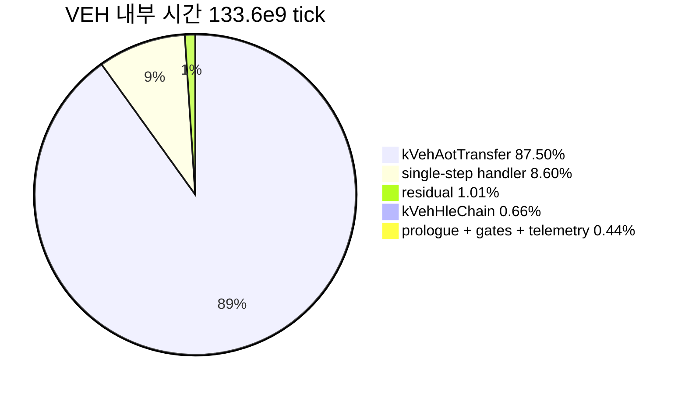

# 20260727-325 작업 로그: VEH boundary 경로 비용 귀속 / Work log

설계: [20260727-325-veh-boundary-path-attribution.md](../design/20260727-325-veh-boundary-path-attribution.md)

작업 지시: [20260727-325-veh-boundary-path-attribution.md](../work-orders/20260727-325-veh-boundary-path-attribution.md)

## 한국어

### 결론 요약

Task 324가 원인 가설을 기각한 뒤 남아 있던 미귀속 블록의 정체가 확정됐습니다.
**AOT transfer 해석부가 VEH 내부 시간의 87.50%, guest thread wall-clock의 71.31%를
차지합니다.** 호출당 평균은 `1,269,368 tick`(2.5GHz 기준 약 508us)입니다.

착수 전 의심했던 다른 후보는 모두 기각됐습니다. live telemetry의
`InterlockedExchange` 9회는 0.08%, single-step 이후 HLE 핸들러 체인은 0.66%,
prologue 검증부는 0.25%입니다.

### 구현 개요

1. `ExecutionTimeBucket`에 `kVehPrologue`, `kVehAotTransfer`, `kVehTelemetry`,
   `kVehBoundaryGates`, `kVehHleChain`을 append했습니다(기존 인덱스 보존).
2. `DispatchGuestException`의 다섯 구간을 각각 scope로 감쌌습니다.
   - 조기 `return`이 많은 AOT transfer 구간과 boundary gate 구간은 블록으로 감싸
     scope가 모든 탈출 경로에서 닫히게 했습니다.
   - prologue와 telemetry는 단일 렉시컬 블록이 아니므로 `std::optional`로 감싸
     구간 종료 시점에 명시적으로 `reset()`합니다.
   - 핸들러 호출 순서와 중간의 terminal-failure 검사 순서는 바꾸지 않았습니다.
3. loader summary에 하위 bucket별 tick/count/비율과 파생 residual을 출력합니다.
   기존 `kVehExclusive`/`kUnaccounted` 계산식은 바꾸지 않았습니다. 새 bucket은
   `kVehTotal`의 분해이지 추가 항목이 아니기 때문입니다.
4. 신규 `execution_time_profile_probe`가 누적, VEH 깊이 추적, 열거 인덱스 안정성,
   `sum(VEH 하위 bucket) <= kVehTotal` 불변식, 비활성 시 무누적을 검증합니다.

### 검증 결과

1. Win32 x86 Debug 전체 빌드 통과.
2. `repiu_aot_probe` 전체 통과. 신규 `execution_time_profile_all=true` 포함
   11개 probe 그룹 모두 `true`.
3. 60초 `aot-dbt` ON/OFF 각 1회. 두 실행 모두 정상 timeout, AOT legacy fallback 0,
   malformed dispatch 0, EEPROM SHA-256 `A1FC1D...52570` 일치. OFF snapshot은 두
   profile 모두 `enabled=false`이고 카운터가 0이었습니다.

### VEH 내부 분해 (60초, profile ON)

분모 `kGuestRunTotal = 163,954,867,388 tick`(약 65.6초),
`kVehTotal = 133,621,088,574 tick`(전체의 81.50%).

| 구간 | count | TSC tick | VEH 대비 | 전체 대비 |
|---|---:|---:|---:|---:|
| **`kVehAotTransfer`** | 92,107 | **116,922,489,925** | **87.50%** | **71.31%** |
| single-step handler (Task 322) | — | 11,491,412,362 | 8.60% | 7.01% |
| `kVehHleChain` | 9,912 | 878,195,513 | 0.66% | 0.54% |
| `kVehPrologue` | 92,108 | 336,586,801 | 0.25% | 0.21% |
| `kVehBoundaryGates` | 67,354 | 140,939,694 | 0.11% | 0.09% |
| `kVehTelemetry` | 67,426 | 103,169,823 | 0.08% | 0.06% |
| `kVehResidual` (파생) | — | 1,354,649,177 | 1.01% | 0.83% |

`kVehAotTransfer` 호출당 평균은 `1,269,368 tick`입니다.

### 판정

설계가 사전 고정한 gate 결과입니다.

| gate | 관측 | 판정 |
|---|---:|---|
| `kVehAotTransfer` >= 50% | 87.50% | **성립.** 내부를 재분해 |
| `kVehHleChain` >= 50% | 0.66% | 기각 |
| `kVehPrologue` >= 30% | 0.25% | 기각 |
| `kVehTelemetry` >= 20% | 0.08% | 기각 |
| `kVehResidual` >= 50% | 1.01% | 기각. 분해 경계가 옳았음 |

gate가 전제한 인과를 코드로 재확인했습니다. `kVehAotTransfer`는
`HandleAotGuestCodeWrite{Completion,Fault}`, `HandleAotReentry`,
`HandleAotIndirectTransfer`, `HandleAotConditionalTransfer`,
`HandleAotReturnTransfer` 여섯 개만 포함하며, 전제대로 transfer 해석을 실제로
수행합니다.

### 다음 작업 후보 (코드 판독, 미검증)

재분해 전 코드 판독으로 확인한 후보를 기록합니다. **Task 322에서 코드 판독만으로
결론을 내렸다가 틀린 적이 있으므로 이들은 가설이며, 계측 전에는 확정하지 않습니다.**

* `AccumulateAotResidency`는 AOT 재진입이 성공할 때마다 `ZydisDecoderInit`를 재초기화하고
  최대 64회 `ZydisDecoderDecodeFull`을 수행합니다. 순수 통계 목적 함수입니다.
* `ResolveAotTransferTarget`은 진입 즉시 `IsAotHleBoundaryAddress`를 호출하며, 이는
  `aot_excluded_guest_ranges`에 대한 선형 탐색입니다.
* `RequestAotDynamicTranslation`은 cache miss 시 동적 번역을 유발할 수 있습니다.

### 미확정 / 해석 주의

* **처리량 편차가 큽니다.** 이번 ON 실행의 progress는 10,643, heartbeat 134,852인
  반면 OFF 실행은 29,275 / 411,974였습니다. 계측 부담 추정치(VEH 진입당 rdtsc 약
  12회, 전체의 0.1% 미만)로는 이 차이를 설명할 수 없습니다. 단일 쌍 표본으로는
  계측 비용과 실행 간 편차를 분리할 수 없으므로, **이 쌍을 계측 부담의 측정값으로
  사용하지 않습니다.** Task 322의 같은 비교는 `-5.32%`였습니다.
* 위 편차에도 구성비 결론은 흔들리지 않습니다. VEH 비율은 Task 323 이후 네 번의
  실행에서 81.50~86.38%로 안정적이었고, `kVehAotTransfer` 87.50%는 경계값이
  아닙니다.
* Debug 빌드 측정입니다. 순차 decode와 `std::vector` 순회는 Release에서 상대적으로
  싸므로 구성비는 Debug 조건의 상대값입니다.

---

## English

### Summary

The unattributed block that survived Task 324's rejected hypothesis is now identified: AOT
transfer resolution holds 87.50% of time inside the VEH and 71.31% of guest-thread wall
clock, averaging `1,269,368` ticks (about 508us) per call. Every other suspect is rejected:
the nine live-telemetry `InterlockedExchange` writes account for 0.08%, the post-single-step
HLE handler chain 0.66%, and prologue validation 0.25%.

### Implementation

Five buckets were appended to `ExecutionTimeBucket`, preserving existing indices, and the
corresponding regions of `DispatchGuestException` were wrapped. Regions with early returns are
enclosed in blocks so the scope closes on every exit path; the prologue and telemetry regions
are not single lexical blocks, so they use `std::optional` with an explicit `reset()` at the
region boundary. Handler order and the interleaved terminal-failure checks are unchanged. The
loader summary reports per-bucket ticks, counts, shares, and a derived residual without
altering the existing `kVehExclusive` and `kUnaccounted` formulas, because the new buckets
decompose `kVehTotal` rather than adding to it. A new probe verifies accumulation, VEH depth
tracking, enumeration index stability, the `sum(VEH sub-buckets) <= kVehTotal` invariant, and
no accumulation when disabled.

### Verification

The full Win32 x86 Debug build passed and `repiu_aot_probe` reported all eleven probe groups
true including the new `execution_time_profile_all`. Both 60-second `aot-dbt` runs reached
their timeout with zero AOT legacy fallback, zero malformed dispatch, and a matching EEPROM
SHA-256, with the off run reporting both profiles disabled and all counters zero.

### Result and gates

Against a `163,954,867,388` tick denominator with `kVehTotal` at 81.50%, `kVehAotTransfer`
held 87.50% of VEH time across 92,107 calls, the single-step handler 8.60%, `kVehHleChain`
0.66%, `kVehPrologue` 0.25%, `kVehBoundaryGates` 0.11%, `kVehTelemetry` 0.08%, and the derived
residual 1.01%. The first pre-registered gate holds and every other is rejected; the low
residual confirms the decomposition boundaries were drawn correctly. The causal premise was
re-checked against the code: the bucket contains only the six AOT transfer handlers and does
perform transfer resolution as assumed.

### Next candidates, from code reading only

Recorded as hypotheses, not conclusions, because Task 322 drew a wrong conclusion this way:
`AccumulateAotResidency` re-initializes a Zydis decoder and decodes up to 64 instructions on
every successful re-entry purely for statistics; `ResolveAotTransferTarget` calls the linear
`IsAotHleBoundaryAddress` scan on entry; and `RequestAotDynamicTranslation` can trigger dynamic
translation on a cache miss.

### Caveats

Throughput varied widely between the pair: the profiled run reached progress 10,643 and
heartbeat 134,852 against 29,275 and 411,974 unprofiled. The estimated instrumentation cost
(about twelve `rdtsc` per VEH entry, under 0.1% of total) cannot explain that gap, and a single
pair cannot separate instrumentation cost from run-to-run variance, so this pair is not used as
a measurement of profiling overhead; the equivalent Task 322 comparison was -5.32%. The
composition conclusion does not depend on it: the VEH share has stayed between 81.50% and
86.38% across four runs since Task 323, and 87.50% is not a marginal value. These are
Debug-build shares, where sequential decoding and `std::vector` traversal are relatively more
expensive than in Release.
